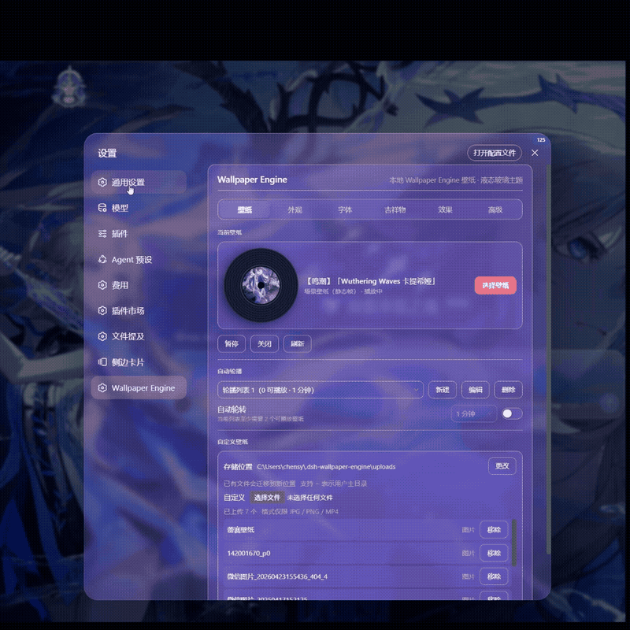
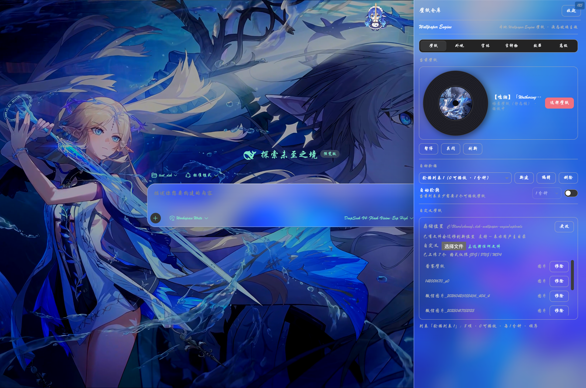
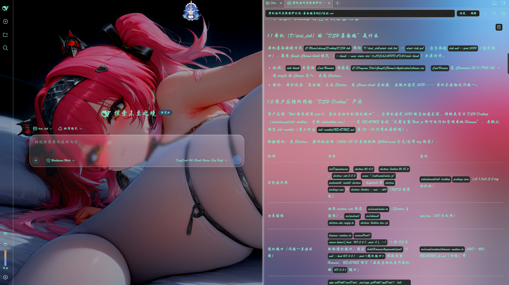

# dsh-plugin-wallpaper-engine

[English](README.en.md) | [中文](README.md)

> 🆕 Never used the command line? Start here: **[beginner-friendly guide →](README.beginner.md)** (a simplified walkthrough in Chinese for users who have never touched a terminal).

A DSH bundle that turns your **Wallpaper Engine** wallpapers into the **background of the DSH web GUI** (`dsh web`).


> Wallpaper + scrim + iOS liquid glass rendered behind the DSH GUI.

It discovers the Wallpaper Engine install on your machine, lists its wallpapers, and renders the *portable* ones behind the DSH chat interface with an iOS-style **liquid glass** effect. What you get out of the box:

- **All four wallpaper types covered** — Video (`.mp4`) with hardware decoding, Web/HTML rendered live by the built-in **WebWallGL** engine (with the WE API shim, falling back to a compatible iframe), Scene also rendered live by WebWallGL (falling back to the full-scene frame chain), Image via custom uploads (local JPG / PNG / MP4);
- **One look, fully controllable** — accent colour, glass colour and transparency, liquid glass for the whole settings window and the sidebar, custom typography and input-caret colour; everything applies instantly and persists;
- **Eight picture sliders** — wallpaper blur / brightness / contrast / saturation / wallpaper opacity / scrim / border / glass (text-bearing surfaces keep a readability floor, so no setting can make body text illegible);
- **Battery & performance** — occlusion pause (minimize / focus-loss / battery, three toggles) and a decode frame-rate cap (host-side frame-skip transcode that cuts hardware-decoder load sharply);
- **Library management** — thumbnail picker modal, hide / restore (soft delete), content-rating and type filters, CD-rack compact layout, spinning vinyl record;
- **Automatic rotation** — any number of user-defined lists, each with its own interval and playback order;
- **Mascot pull-cord** — a rope along the top of the chat; pull it down to open the **wallpaper repo** drawer (six tabs of quick controls);
- **Settings stored in a host file** (since v0.4.0) — they survive restarts, port changes, browser-data clears and browser switches.

> The full feature list and the per-release change log live in **[`docs/CHANGELOG.md`](docs/CHANGELOG.md)** (Chinese-first, English section included).

> ⚠️ **Two prerequisites before you update this plugin**: ① the DSH kernel / DSH Desktop is current (harness 0.1.5-rc.1, DSH Desktop ≥ 2.0.7); ② dsh-better-sidebar ≥ 0.19.0 (if you are still on the older 0.1.2-rc.1 kernel, stay on 0.18.x — do not mix).
>
> The correct update order, the compatibility matrix and how to recover from updating out of order: **[`docs/UPGRADING.md`](docs/UPGRADING.md)**.

## Which wallpaper types are supported?

Wallpaper Engine wallpapers come in four types:

| Type | Rendered by | Portable to DSH? |
|---|---|---|
| **Scene** | Wallpaper Engine's own 3D engine | ✅ Real-time — the built-in WebWallGL WebGL engine (particles / scripts / parallax / packaged audio); falls back to scene frames on failure |
| **Video** | a plain `.mp4` file | ✅ Yes — plays in a `<video>` tag |
| **Web** | a Chromium (`webwallpaper64.exe`) host for HTML | ✅ Real-time — WebWallGL's web mount with the **injected WE API** (audio/property/media listeners) under a strict sandbox; falls back to a plain iframe on failure |
| **Application** | an injected external window | ❌ No |

Scene wallpapers are replayed in real time by the plugin's built-in **WebWallGL
engine** (`lib/webwallgl/`, MIT, upstream [webwallgl](https://github.com/oneincase/webwallgl)):
it parses `scene.pkg`'s object tree in WebGL2 and renders every image layer
(shader effects translated from HLSL and executed on the GPU), puppet skeletal
models, particle systems and text objects, runs the scene's own SceneScript —
mouse movement drives parallax / cursor interaction, and packaged audio (BGM /
SFX) plays under the shared volume / audio-switch settings.

> **Rendering form & fallback**: the renderer page runs in a same-origin
> isolated iframe under a **heartbeat watchdog** — a 15 s first-frame timeout,
> or **40 s** without a frame while playback is expected (the heartbeat ticks once
> per second and issues one rescue `resume()` at 20 s), marks the wallpaper failed
> and degrades it to the
> embedded-MP4 → static-frame chain. Loose `scene.json` directories and
> environments without WebGL2 use that chain directly. Failure memory is
> cleared by re-toggling 「场景实时渲染」 (「网页实时渲染」 for web wallpapers) in the settings. The static-frame
> chain (in-house scene renderer, CPU effect chain by default, GPU acceleration optional, below) remains the underlay and the fallback.

> **What the static-frame fallback looks like**: the in-house renderer outputs a **3840-wide** full scene
> frame (height derived from the scene aspect — 2160 for a 16:9 scene) with background + water + back
> hair + character + umbrella + particles, close to the original for photographic, illustration and
> animation-screenshot scenes. On failure (pure shader/procedural scenes, exotic texture formats) it
> falls back to the older main-texture extractor, then to the workshop preview image (`preview.jpg`) —
> expected behaviour, not a defect.

**Web wallpapers** go through WebWallGL too: the host injects the **WE API shim**
(`wallpaperRegisterAudioListener` / `wallpaperPropertyListener` / media
listeners, from upstream `web-shim.js`, injected into the entry HTML by
`/scene-files`) and hands the page to the renderer — so workshop web wallpapers
that depend on the WE API (audio visualizers, property-driven and pointer-tracking
pages) actually run instead of rendering blank or erroring. **Security**: the
wallpaper iframe is forced into `sandbox="allow-scripts"` (strict sandbox) so the
third-party HTML can never inherit the DSH origin (it cannot call host APIs or
read host storage as the app). Cross-origin control and pointer injection go
through the renderer page's `postMessage` channel. On load failure or a stalled
runtime the wallpaper is remembered and degrades to the legacy plain iframe
(no WE API).
>
> **Payload origin (separate media origin)**: a web wallpaper's entry HTML and all of
> its subresources are served by a **dedicated loopback media origin the host opens
> itself** (a random port on `127.0.0.1`, reported by
> `GET /wallpaper-engine/media-origin`) — *not* by the plugin's HTTP routes. Why: DSH
> Desktop wraps every plugin route in a capability-header fence
> (`x-dsh-desktop-renderer`, injected only into requests issued by same-origin
> frames), and a strict-sandbox iframe is an opaque origin that can never carry that
> header — the wallpaper entry would always answer `403 Forbidden` (symptom: the
> preview frame looks fine, then the wallpaper goes fully black). The media origin
> bypasses that fence, and third-party HTML no longer shares the host origin at all,
> so the sandbox gets a second layer of isolation.
>
> **Frame cap and "it still stutters"**: the wallpaper's rAF cap is implemented by
> **frame skipping** — every vsync is kept so the delivered frame stays phase-aligned
> with the display and only every n-th frame reaches the page (a `setTimeout`-based cap
> yields 17/33/50ms jitter, which looks worse). While live, a `live-fps` line is written
> to the diagnostics file every 5 s: `ui=` whole-page fps, `web=` the wallpaper's own
> fps, `rnd=` renderer-page fps, `cap=` the current cap. If it still feels heavy, that
> line tells you whether the wallpaper itself is slow (`web` low) or the whole page is
> (`ui` low too — e.g. the sidebar's `backdrop-filter` re-sampling the wallpaper every
> frame; try lowering the blur to confirm).

> **Known web-wallpaper limits**: author `fetch`/`XHR` carries `Origin: null` under
> the opaque origin (the host answers with `Access-Control-Allow-Origin: *`, so
> ordinary resources load); `wallpaperMediaIntegration` (system Now Playing / cover
> art) **is** supplied by the host — see "System-audio reaction and Now Playing"
> below; CSS `:hover` interaction driven by the browser's own hit-test cannot be
> triggered by external pointer injection (as documented upstream).

### System-audio reaction and Now Playing (song info + cover art)

Two switches in the「效果」tab (both on by default):

| Switch | What it does |
|---|---|
| **系统音频反应** | Feeds a spectrum of **whatever the system is playing** (any app) to the wallpaper's audio-reactive effects. It is the system-output **loopback**, not the microphone, and it is built in on all three platforms — no extra installs: CoreAudio on macOS, WASAPI loopback on Windows (**no "Stereo Mix" or virtual sound card needed**), PulseAudio/PipeWire on Linux. Only macOS asks once for "audio recording" permission on first use; when no audio can be captured the wallpaper falls back to its built-in simulated spectrum |
| **媒体信息** | Hands the system **Now Playing** (title / artist / album / album artist / playback / timeline / **cover art**) to the wallpaper through the official WE APIs `wallpaperRegisterMediaPropertiesListener` / `wallpaperRegisterMediaThumbnailListener` / `wallpaperRegisterMediaPlaybackListener` (plus `…TimelineListener`) |
| **在线歌词** | Lyrics come from local sources first (a `.lrc` next to the audio file, or an already-cached copy); when enabled, a missing lyric triggers one query to [lrclib.net](https://lrclib.net) — that request sends title/artist/album, hence **off by default** |

> **Where this data comes from**: the host runs a bundled Rust middleware,
> [media-bridge](https://github.com/oneincase/media-bridge), as a child process (stdio NDJSON;
> downloaded on first use, sha256-verified, cached under `~/.dsh-wallpaper-engine/bin/`) —
> MediaRemote on macOS, the system media session (GSMTC) on Windows, MPRIS over D-Bus on Linux;
> system audio comes from a CoreAudio Process Tap (14.2+), WASAPI loopback and PulseAudio/PipeWire
> monitors respectively. So `brew install media-control`, `playerctl`, "Stereo Mix"/VB-Cable and
> even compiling a Swift helper on your machine (Xcode Command Line Tools) are all no longer needed.
> When the middleware cannot be fetched or started, the plugin falls back to its built-in
> implementation and reports the reason in `GET /wallpaper-engine/media-status` (`fallback`).
>
> **Cover art**: written by the middleware under a content-fingerprinted name (a new file per
> track), proxied by the host at `/wallpaper-engine/now-playing/artwork`, then downscaled to 512²
> and converted to a **self-contained data URL** before it reaches the wallpaper — plugin routes
> are fenced by the host capability gate on Desktop (a cross-origin sandboxed wallpaper cannot
> fetch them), while a data URL depends on no origin and can be drawn into a canvas untainted.
>
> **Who owns the timeline (renderer side)**: the bundled WebWallGL page ships a demo media
> source (so previews look alive) that only steps in when the host provides **no** media.
> As soon as the host pushes a snapshot with `hasMedia`, that source is stored on the
> renderer's `rt.mediaSource` and properties / thumbnail / playback / position / duration
> all follow the host. (Older renderer builds kept pushing the demo source's fake progress
> once per second and overwrote the host's timeline — fixed in WebWallGL, and the plugin's
> real-browser end-to-end test now guards it.)

### Static-frame fallback: how it works

- **Object tree**: parses `scene.pkg` (PKGV container + LZ4 entry chains) or a
  loose `scene.json` directory, topologically sorts every object (image /
  particle / text / sound) by dependencies / parent.
- **image layers**: loads the material main textures (RGBA8888 / DXT1/3/5 …),
  positions them in scene coordinates (origin / scale / angle accumulated down
  the parent chain), and applies alpha / brightness.
- **puppet meshes**: MDL (MDLV) mesh + bind-pose rasterization (software
  raster + bilinear UV sampling + alpha compositing), so skeletal models like
  the character / back hair display correctly.
- **shader effect chain**: waterwaves (incl. the dual-wave DUALWAVES product) /
  waterripple / shake are implemented in the CPU with the exact shader math;
  mask textures are supported.
- **particle systems**: boxrandom / sphererandom emitters, color / size / alpha /
  lifetime / velocity / rotation initializers, movement / alphafade / sizechange /
  turbulence / oscillate* operators, and sprite drawing.
- **Atlas padding is trimmed**: a scene's main texture is often a power-of-two **atlas**
  (2048²/4096²) where the artwork occupies just one band and the rest is pure black. The
  static frame is cropped to the artwork itself (uniform black edges only; a crop leaving
  too little is skipped), so the loading placeholder fills the screen instead of being
  anchored to the atlas centre and showing mostly black.
- **Cache**: results are cached at `~/.dsh-wallpaper-engine/cache/frames/`
  keyed by `sf45_<gpu-flag><source-flag>_<path>_<mtime>` (`sf45` = current pipeline
  version; GPU/CPU and full-render/main-texture-approximation never share an entry —
  override the root with `DSH_WE_CACHE_DIR`);
  workshop updates and renderer upgrades invalidate the frame automatically.
  A cold-cache first render measures **~2–10 s** (depends on the scene's layer count;
  same-machine measurements in [`docs/SCENE-FRAME-PERF.md`](docs/SCENE-FRAME-PERF.md)),
  then near-instant on cache hit.

## How it works

- **Host half** (`lib/index.js`): a Cordis plugin that
  1. locates the Wallpaper Engine install by reading Steam's `libraryfolders.vdf`
     (so it works even when Steam is on a non-default drive),
  2. enumerates wallpapers from `projects/defaultprojects`, `projects/myprojects`,
     and `steamapps/workshop/content/431960/*`,
  3. registers same-origin HTTP routes on the DSH webserver so the browser half
     can fetch data and stream media directly:
     - `GET /wallpaper-engine/inventory` → JSON list of wallpapers
     - `GET /wallpaper-engine/media/<token>` → video / HTML (Range supported)
     - `GET /wallpaper-engine/preview/<token>` → preview image
     - `GET /wallpaper-engine/video-preview/<token>` → on-demand ffmpeg-extracted thumbnail for a custom MP4 upload (disk-cached)
     - `GET /wallpaper-engine/scene-frame/<token>` → scene full-scene frame (in-house renderer, 3840 wide / height from the scene aspect, falls back to main-texture extraction, PNG/JPG disk-cached; also the live renderer's underlay; `?v=` selects the frame-source tier)
     - `GET /wallpaper-engine/scene-live/*` → the vendored WebWallGL renderer page (built into `lib/webwallgl/`, loaded by the live-render iframe)
     - `GET /wallpaper-engine/scene-files/<token>/<path>` → raw scene wallpaper files (`scene.pkg` / `project.json` …, Range supported; the renderer page parses the container itself; web wallpapers get the WE shim + property seed injected here)
     - `GET /wallpaper-engine/scene-video/<token>` → the scene's author-embedded MP4 (hardware-decoded playback, Range supported; 404 when there is none, and the client falls back to the static frame)
     - `GET /wallpaper-engine/scene-audio/<token>` → the scene's packaged standalone audio (played for scenes without an embedded MP4, under the shared volume / audio-switch settings)
     - `GET /wallpaper-engine/web/<token>/<entry-file>` → sub-resources of multi-file web wallpapers (for the compatible-iframe fallback chain; relative refs resolve against the entry's own directory, CSS / SVG get correct MIME types)
     - `GET /wallpaper-engine/scene-files/<token>/<path>` → raw scene wallpaper files (`scene.pkg` / `project.json` …, Range supported; the renderer page parses the container itself). The same path is also mounted on the **separate wallpaper media origin** (see above); web-wallpaper payloads are fetched from there
     - `GET /wallpaper-engine/media-origin` → reports the active wallpaper media origin (diagnostics: which origin a web wallpaper is loaded from)
     - `POST /wallpaper-engine/upload` → upload a custom wallpaper (JPG / PNG / MP4, raw bytes)
     - `GET /wallpaper-engine/custom-frame/<token>` → the user-imported "custom frame" (the last frame tier, `overrides/`)
     - `POST /wallpaper-engine/remove` → remove an uploaded wallpaper
     - `POST /wallpaper-engine/upload-dir` → change the upload directory (persisted to `~/.dsh-wallpaper-engine/config.json`, migrates existing files)
     - `GET /wallpaper-engine/settings` → read plugin settings (v0.4.0)
     - `PUT /wallpaper-engine/settings` → save plugin settings (v0.4.0, written to `~/.dsh-wallpaper-engine/config.json`)
     - `GET /wallpaper-engine/media-info/<token>` → media metadata (resolution / codec / fps / duration, from a moov probe)
     - `GET /wallpaper-engine/transcoded/<token>?fps=N` → frame-skip transcode stream (one-time ffmpeg re-encode, disk-cached)
     - `GET /wallpaper-engine/transcode-progress/<token>?fps=N` → download / transcode progress (progress-bar polling)
- **Client half** (`lib/client.js`): a browser module that fetches the inventory
  and renders the selected wallpaper into a fixed layer *behind* the app columns,
  plus a **first-level settings page** "Wallpaper Engine" (liquid-glass card,
  picker modal, hide/restore, playback speed / flip, accent color + glass
  transparency, and custom-upload management).
- **Custom-upload storage**: uploaded files are written to a plugin-managed local
  directory (default `~/.dsh-wallpaper-engine/uploads`, changeable from the
  settings UI) and served through the same `/media` + `/preview` routes as WE
  media — identical pipeline, survives restarts, no browser quota limits.

## Settings persistence (v0.4.0)

**All your settings (selected wallpaper, colors, transparency, layout, rotation,
hidden wallpapers, playback speed / flip, …) are stored in a host-side file
since v0.4.0 — no longer in browser localStorage.**

- **Where**: `~/.dsh-wallpaper-engine/config.json` (the same file that stores
  the upload-directory preference). Concrete locations:
  - Windows: `C:\Users\<your-user>\.dsh-wallpaper-engine\config.json`
  - WSL / Linux / macOS: `~/.dsh-wallpaper-engine/config.json`
- **Why**: settings used to live in browser localStorage, which is isolated by
  *origin* (scheme + host + **port**). DSH Desktop starts the harness on a
  **random port every launch**, so each start looked like a brand-new storage
  space and every setting fell back to defaults (plain web on a fixed port was
  unaffected). Storing on the host makes persistence port-independent.
- **What you get**: settings survive restarts, port changes, browser-data
  clears, browser switches and private windows.
- **Migration**: config saved by older versions in localStorage is **migrated
  automatically on first launch** — nothing to do.
- **Behavior change to know**: on one machine, multiple browsers (e.g. Chrome
  and Edge) or devices pointing at the same dsh now **share one configuration**
  (previously each had its own). If you roll back to an older version, it still
  reads the localStorage cache copy, so nothing is lost.
- **Writes**: every settings change is persisted automatically (debounced
  200 ms); if the file is corrupted the plugin falls back to defaults and does
  not overwrite your file.
- **What still lives in the browser**: only pure UI state — the **active tab**
  shared by the settings page and the drawer (one `localStorage` key), plus the
  mascot rope's **snap position**. Browser `localStorage` also acts as a **synchronous read
  cache** and a fallback when the host routes are unreachable, but it is no longer
  the source of truth for any setting.

## Install

### For users (published version, recommended)

If you simply want to use the plugin, install the published package from npm:

```sh
dsh plugin --profile web add dsh-plugin-wallpaper-engine
```

Then restart `dsh web` and open **Settings → Wallpaper Engine**.

> **macOS users**: Wallpaper Engine has no macOS client. The macOS line of this
> plugin (WaifuX + loose-media support) is maintained by Jerry and published as
> a separate npm package:
>
> ```sh
> dsh plugin --profile web add dsh-plugin-wallpaper-engine-mac
> ```
>
> Repo: https://github.com/ruijiaang-lab/dsh-wallpaper-engine

### For developers (running your own copy)

**For most people you can skip this section.** The full walkthrough for installing from a local
checkout with `link:` (including what "checkout" means and which exact path to fill in) now lives in the
**[contribution guide](CONTRIBUTING.md)** — you only need it if you want to work on the plugin's code yourself.

### Troubleshooting install failures

Symptom-and-fix steps for the common install errors now live in
**[`docs/TROUBLESHOOTING.md`](docs/TROUBLESHOOTING.md)**: a stale pnpm virtual store in the profile
(`ERR_PNPM_UNEXPECTED_VIRTUAL_STORE`), `github:` installs rejected by the `allowBuilds` allowlist
(`ERR_PNPM_GIT_DEP_PREPARE_NOT_ALLOWED`), and a "symptom → where to look first" table.


## Usage

1. Open `dsh web` → the DSH GUI.
2. Open **Settings** and pick **Wallpaper Engine** from the left navigation (a first-level settings page, its own nav entry).
3. Click **选择壁纸** to open the picker modal, then click a Video/Web/Scene wallpaper (or an uploaded image/video) in the thumbnail grid. It appears behind the app; close the modal via the backdrop, ESC, or the close button. Application wallpapers cannot be embedded in the web UI and are hidden from the grid.
4. Use **暂停/播放** to pause a video wallpaper, and **关闭** to clear it.
   The choice is persisted host-side to `~/.dsh-wallpaper-engine/config.json` (the browser's `localStorage` is only a sync cache and fallback — see 「Settings persistence」 below).



> The settings page: the liquid-glass card with six tabs (壁纸 / 外观 / 字体 / 吉祥物 / 效果 / 高级).


> The picker modal: browse every wallpaper thumbnail, batch-hide, and restore from the hidden tab.

### Six adjustment tabs

The settings page and the wallpaper-repo drawer share the same **top category
tabs** — every control is grouped into one of six domains, each tab normally holding
well under a dozen controls instead of a thirty-item single column (the 效果 tab has
the most: with live rendering off and static-frame rendering on, the whole static-frame
chain appears):

| Tab | Contents |
|---|---|
| **壁纸** (wallpaper, default) | current-wallpaper card (vinyl + picker + pause/close/refresh), auto-rotation, custom wallpapers |
| **外观** (appearance) | accent, glass color, glass transparency, settings-window glass, sidebar glass & content surface |
| **字体** (typography) | master switch + color / weight / family, input caret color |
| **吉祥物** (mascot) | visibility switch, form cards (artwork doubles as a live preview), size slider |
| **效果** (effects) | 「画面」 group: wallpaper blur / brightness / contrast / saturate / wallpaper opacity / scrim / border / glass, plus 「自定义画面」 (import a desktop screenshot as a frame source — scene wallpapers only); 「声音」 group: volume + wallpaper audio switch; **「场景实时渲染」** (「网页实时渲染」 for web wallpapers) + real-time render fps (15 / 30 / 60); when live rendering is not in effect, the **「静态帧渲染」** master switch (on by default) and the **「静态帧兜底与调优」** group it scopes — 「出图来源」 (frame source) / lossy route / idle prewarm / GPU acceleration; 「播放与适配」: playback speed, fps cap, fit, flip; 「省电」: the occlusion-pause trio (an empty state guides you to pick a wallpaper first) |
| **高级** (advanced) | compact layout, Edge compatibility |

The pill indicator slides between tabs; the settings page and the drawer share
one stored tab (a single `localStorage` key — switching a tab in the settings page
leaves the drawer opening on that same tab; never written to the config file). Long explanations moved into tooltips — each row keeps a one-line hint.

### Hide & restore (soft delete)

Every wallpaper card has a **隐藏** button in its top-right corner — it only removes the wallpaper from the list, **never touches the source file**. Restore any wallpaper from the **已隐藏** tab in the modal (single restore or **全部恢复**); the **批量** button in the modal toolbar enters multi-select mode to hide several at once. Hidden state is persisted host-side with the rest of your settings (survives refresh / restart / browser switches); hiding the currently playing wallpaper doesn't interrupt playback, and automatic rotation skips hidden wallpapers.

### Content-rating & type filters

Above the thumbnail grid in the picker modal there are two dropdowns that
reproduce Wallpaper Engine's own categorisation:

- **内容分级** (content rating) — reads each wallpaper's `contentrating` field
  (WE wallpapers: `project.json`; custom uploads: `uploads/.meta.json`; the
  field mirrors WE's workshop tags G / PG13 / R): **全部** (all) /
  **Everyone (G, default)** / **PG13** (parental guidance) / **Mature (R)** /
  **未分级** (unrated — wallpapers without the field, typically local projects).
  An upload without a rating counts as **Everyone**
  ([#84](https://github.com/elysia395/dsh-wallpaper-engine/issues/84): the
  default filter would otherwise hide the user's own files entirely — absent
  from the grid and impossible to select).
- **类型** (type) — filters by the embeddable type: **全部** (all) / **视频**
  (video) / **网页** (web) / **图片** (image, custom uploads) / **场景** (scene —
  live-rendered by default, falling back to a static frame when unavailable).

Every option shows how many playable wallpapers currently match. Wallpapers
outside the selected categories are dropped from the grid, the rotation editor
and the rotation candidates — they are never auto-selected or rotated either.
The choice is persisted host-side to `config.json`; the default is **Everyone**,
mirroring Wallpaper Engine's conservative first-run stance.

> Note: the rating is read from each wallpaper file's `contentrating` field —
> the same rating WE's client shows — but the plugin does **not** follow the
> adult-content switch inside the Wallpaper Engine client (it scans the disk
> directly and bypasses WE's configuration).

### Card style & vinyl record

- **紧凑布局 (compact layout)**: a sliding toggle in the **高级** (advanced) tab.
  ON gives the **CD-rack** look — cards stack like CD jewel cases
  (each row's top covers the row above, vertical only), hovering scales the
  card up and brings it to the front, the grid is tighter (~7 cards per row)
  and shows everything on ONE page with no pagination. OFF is the regular
  grid (fixed-height overlap-proof cards with pagination, default). The
  choice is persisted host-side to `config.json`.
- **黑胶唱片 (vinyl record)**: next to the wallpaper selection there is a
  **rotating vinyl record** that uses the selected wallpaper's cover as the
  record label — it spins while the wallpaper plays and stops when paused
  (animation is disabled under `prefers-reduced-motion`). A small record also
  sits in the picker modal head. The vinyl shows in **both** card styles.

### Playback speed & horizontal flip

With a video wallpaper selected, the **效果** (effects) tab shows the **倍速** presets (0.5x / 0.75x / 1x / 1.25x / 1.5x / 2x) — driven by the browser's native `playbackRate`, instant, no reload or black flash (wallpaper videos are muted, so there is no audio to keep in sync). The **水平翻转** toggle mirrors **every wallpaper type (scenes included — both live-rendered and static-frame forms)** via CSS `scaleX(-1)` applied to the whole wallpaper layer, with zero main-thread cost.

### Occlusion pause (battery-saving trio)

Like Wallpaper Engine's "pause when covered" — the main reason desktop WE is ~0 GPU most of the time. Browsers cannot detect window occlusion directly, so the plugin uses the three closest signals (toggles in the **效果** tab, instant + persisted):

| Toggle | Default | Behavior |
|---|---|---|
| **最小化/切页时暂停** (pause on minimize/tab-switch) | on | pauses the video when the page is hidden (minimized / tab switched away); the decoder drops to zero — explicit `pause`, since browser throttling alone does not guarantee stopped decoding |
| **窗口失焦时暂停** (pause on focus loss) | off | pauses when another app takes focus (the wallpaper is likely covered) |
| **使用电池时暂停** (pause on battery) | off | pauses while on battery via `navigator.getBattery` (no-op in browsers without it) |

Playback resumes automatically when you come back / regain focus / plug in (unless you paused manually). It applies to video wallpapers **and to live-rendered scene / web wallpapers** (the latter pause their render loop through the control surface, so GPU usage drops too); only the **plain iframe web wallpaper** left after a fallback cannot be paused from outside, and is merely throttled by the browser while the page is hidden.

### Decode frame-rate cap (frame-skip transcode)

High-fps sources (e.g. 4K120 H.264) dominate GPU decode (~60% Video Decode at 1.0x on a 4060). The **帧率上限** control (unlimited / 60 / 48 / 30 / 24 fps) has the host re-encode the wallpaper ONCE to the capped frame rate via ffmpeg — the timeline stays **1.0x normal speed** and stays fully decoupled from 倍速 — output is **4K-preserving AV1** (NVDEC decode throughput for AV1 is roughly 2× H.264), cached under `~/.dsh-wallpaper-engine/cache/transcodes/`.

- The original plays **first**, and the app swaps to the transcoded file when ready; the settings page shows a **live progress bar** (downloading ffmpeg % → transcoding % with an estimated-seconds-readout → finalizing → switch). First run takes a few tens of seconds (including a possible one-time ffmpeg download); afterwards the same wallpaper opens instantly.
- Sources at/below the cap are skipped; transcode failures transparently fall back to the original — nothing else is affected.
- Measured: 4K120 → 24fps AV1 drops GPU from ~60% to **~15%**.
- Cached per path+mtime+cap, so rotation pays the cost once per wallpaper.

**ffmpeg provisioning (three tiers, auto-detected in order)**:

| Tier | Notes |
|---|---|
| **Explicit** | `DSH_WE_FFMPEG` env var pointing at any ffmpeg binary, or drop one into the plugin dir as `./ffmpeg/ffmpeg(.exe)` — both take priority |
| **Auto-download** | with no local ffmpeg, the first use downloads a pinned single-file build for the platform (Windows x64 / Linux x64·arm64 / macOS x64·arm64 etc., asset table verified) from a **dual-source race**: `npmmirror` (fast in CN) vs GitHub release (fast elsewhere), first success wins — streamed to disk, magic-byte/size verified, 5-minute per-source timeout, cached at `~/.dsh-wallpaper-engine/ffmpeg/`. `DSH_WE_FFMPEG_URL` overrides the source (self-hosted mirror / proxy). |
| **System PATH** | falls back to a bare `ffmpeg`; if none exists the wallpaper silently stays on the original |

> Transcoding uses **NVENC** (`av1_nvenc`, falling back to `h264_nvenc`) and requires an NVIDIA GPU + driver; without one the feature auto-disables. No ffmpeg or a failed transcode simply disables the feature — no side effects.

### Wallpaper properties (live author-property editing)

When the current wallpaper is a **scene** or **web** wallpaper, the 「当前壁纸」 card shows a
green **壁纸属性** button next to 「选择壁纸」. It opens the adjustable properties the author
defined in the WE editor (color / bool / slider / combo / text / file); applying one takes
effect **immediately** (`__wp.updateWebProps`) — no re-mount needed.

- Definitions come from the wallpaper's `project.json` → `general.properties`, labels from its
  own `general.localization` (per-key fallback zh-chs → zh-cht → en-us); properties carrying a
  `condition` show/hide by the current values, and `editable: false` internals are hidden from
  the panel while still being sent to the wallpaper (WE semantics).
- Edits are **remembered** per wallpaper: after a reload/restart a web wallpaper receives them
  with its HTML seed, a scene wallpaper gets them replayed once live rendering is ready.
  「恢复默认」 clears every edit for that wallpaper.
- The panel shows the values **actually in effect** (read back from the renderer, since a
  scene's defaults live in its own snapshot), not just the project.json defaults.
- If live rendering is not active (static frame / compat mode) the panel says so; edits apply
  once live rendering takes over.

### Custom wallpapers

The **自定义壁纸** section uploads local images (JPG / PNG) or videos (MP4) as wallpapers:

- **Storage location**: files default to `~/.dsh-wallpaper-engine/uploads` (your home directory — usually the C: drive). Click **更改** to move storage to any drive (absolute path, `~` supported); existing files migrate automatically and the choice persists across restarts — recommended for users who don't want wallpaper data on the system drive.
- **WE project directories** are recognized in the same location: any subfolder with a `project.json` (shipping `scene.pkg` / `scene.json` / `index.html` / `*.mp4`) becomes a wallpaper of the matching type — scene wallpapers render live. Folders are scanned in chunks (~30 ms for hundreds), are read-only (never listed under upload management, never removable), and loose `preview.jpg/png/gif` files are used as thumbnails.
- **Format limit** for direct uploads: JPG / PNG / MP4 only; validated twice (browser + host) with a clear error message.
- **Video thumbnails**: uploaded MP4s get an on-demand ffmpeg-extracted thumbnail in the picker (the first second is skipped to avoid black fade-ins), cached under `~/.dsh-wallpaper-engine/cache/video-previews/`; without ffmpeg the card keeps the "no preview" placeholder and playback is unaffected.
- **Fit modes**: 覆盖 (cover) / 填充 (contain) / 居中 (center) / 拉伸 (fill) — applied to every wallpaper type (web iframes don't read `object-fit`, so they are unaffected).
- **Management**: each upload can be **移除** (confirm dialog, deletes the local file); uploaded wallpapers also support hide/restore, playback speed, and flip.
- **Deduplication**: re-uploading an identical file is detected by content (SHA-256) and returns the existing entry — no duplicate copies pile up in the library.

### Automatic rotation (轮播列表)

Rotation runs over **user-defined carousel lists** (the 自动轮播 group in the **壁纸** tab). Create any number of lists with **新建**, pick Video/Web wallpapers — or a Scene whose frame is available — into each from the inventory, give each list its own switch interval (1, 5, 10, 30, 60 or 120 minutes) and order (顺序/随机), then enable **自动轮转** on the list you want active. Lists are persisted host-side to `~/.dsh-wallpaper-engine/config.json`; **rotation runs entirely client-side** and never depends on Wallpaper Engine's own `config.json` playlist paths.

At least two playable wallpapers per list are required (Video/Web/Scene); manual changes reset the next timer; each list keeps its own cadence, so you can have one list switching every 5 minutes and another every 30. On first run, the first playable Wallpaper Engine playlist is imported automatically as a list so the feature works out of the box; **从 WE 播放列表导入** inside the editor imports any other playlist into the list being edited. Application wallpapers cannot be embedded in the web UI, so they are automatically excluded from rotation and hidden from the picker; Scene wallpapers (live-rendered, falling back to a static frame) can join rotation.

Rotation switches only when the next wallpaper is **fully ready**: at switch time the next candidate is prepared in the background (live renderer first frame / static-frame extraction / video canplay / image decode) while the current wallpaper keeps playing; the commit then cross-fades old and new layers over 1.2s, so the new layer is alive on arrival with no black flash. A candidate that fails to prepare (e.g. a 404 video) is skipped in a bounded chain to the next one. For development/smoke testing, `localStorage.weRotationTestSec` (seconds) temporarily shortens the rotation interval.

### Liquid-glass appearance (whole settings window + accent + transparency)

The **外观** (appearance) tab controls the look
of the **entire native DSH settings window** (following the dsh-web-ui-all
skin-center design):

| Control | What it controls | Range | Default |
|---|---|---|---|
| **设置窗口液态玻璃** (settings-window glass) | Master switch: turns the whole settings window (dialog + left nav + all native sections) into liquid glass | on / off | on |
| **配色** (accent) | Theme color: buttons, switches, links, nav active, sliders and glass highlights inside the window all follow it | 6 presets + custom color picker | `#4f8cff` classic blue |
| **玻璃颜色** (glass color) | The BASE TINT of the settings-window glass itself (not just transparency) | 6 presets + custom color picker | white (light) / deep navy (dark) |
| **玻璃透明度** (glass transparency) | Opacity of the glass surfaces (settings window, composer, bubbles, sidebar panels) | 0–60 % | 12 % |

> With the master switch on, **every native section** (General / Models /
> Plugins / …) and the left nav become one liquid-glass + accent look — the
> plugin overrides the shell tokens scoped to the settings dialog, so nothing
> outside the window is touched. The settings-window glass blur uses the SAME
> adjustment range as the conversation bar: the **玻璃** (glass) slider (0–60 px)
> drives the blur radius of both the settings window and the composer/bubbles,
> with an identical saturation/brightness/contrast recipe; **玻璃颜色** sets the
> base tint of the glass itself (defaults white in light / deep navy in dark;
> once picked, both themes use that color), and the **玻璃透明度** control sets
> the transparency — higher lets the wallpaper colour show through more clearly,
> lower approaches solid. Browsers without `backdrop-filter` automatically fall
> back to a high-opacity solid so text stays readable. All controls apply
> instantly and persist host-side to `config.json` (they survive restarts and
> browser switches).

> **Text-surface readability floor (on by default, not user-adjustable in this
> version)** — every surface that carries text (composer card & tool popups,
> message bubbles, all three settings-window layers, sidebar panels and the
> editor/terminal content plate, the plugin's own wallpaper-repository drawer and
> panel modal) now composites a layer of the **theme base colour** — white in
> light mode, deep navy in dark mode — underneath the glass tint at a fixed
> weight of 45 % (59 % in dark). The values are the smallest that keep body text
> at **WCAG 4.5:1** across the measured grid (glass transparency {0,15,30,45,60}
> × theme × wallpaper opacity {0,50,90}), with the worst case taken at the
> darkest plausible wallpaper pixel (light) and the brightest (dark): worst-case
> body-text contrast improves from **1.00:1 to 4.63:1**. Raising **玻璃透明度** to
> its maximum, or raising **壁纸透明度**, can therefore no longer make text
> illegible — those two sliders only move the glass-tint half of the weight, the
> floor half stays fixed. Semantics are unchanged: glass transparency still means
> "higher = more transparent" and still applies monotonically (you can still make
> a panel clearer or more solid), it just cannot go below the floor; wallpaper
> opacity still drives only the wallpaper layer (`.we-layer`) and still means
> "blend into the page base colour", with no coupling to the floor.

### Mascot (chat pull-cord)

The **吉祥物** (mascot) tab controls the chat **pull-cord** (a draggable rope pinned to the top edge; pulling it down slides out the **wallpaper repo** drawer). The **form** picker renders as cards — each card draws the actual artwork scaled by the current **吉祥物大小** slider, so choosing a form and judging its size happen in one place:

| Control | What it does | Range | Default |
|---|---|---|---|
| **显示吉祥物** (show mascot) | Whether the pull-cord mascot and its wallpaper-repo drawer render | on / off | on |
| **吉祥物形态** (mascot form) | Switch artwork: default **小女仆** (near-square chibi) or **鲸御姐** (portrait 2:3 full-body) | 小女仆 / 鲸御姐 | 小女仆 |
| **吉祥物大小** (mascot size) | Scale the mascot (the rope box follows the ratio; drag / snap geometry adapts automatically) | 0.5×–2.5× | 1× |

> Both artworks are inlined as base64 (transparent background) at build time, so the single-file client bundle stays self-contained. **Size** changes only the rope's own box; the wallpaper-repo drawer below is unaffected. Settings apply instantly and persist to the host-side config file.



> Pull the top rope mascot to slide out the **wallpaper repo** drawer: six-tab quick adjustments with the vinyl card, rotation and custom-wallpaper management within reach.

### Custom typography

The **字体** (typography) tab holds the dedicated typography section. The **master switch defaults to off** — the UI keeps the stock dsh typography with zero injected styling; turn it on to apply the three knobs below. Every change applies instantly and persists (the adjustment panel's own labels always stay in theme ink — they are deliberately excluded from the 字体颜色 tint to keep the panel readable):

| Control | What it does | Range / options | Default |
|---|---|---|---|
| **字体自定义** | Master switch: off = fully restore the stock dsh fonts (one-click reset) | on / off | off |
| **字体颜色** | Global text tint | custom color picker | `#000000` |
| **字重** | Global font weight | 100–900 (step 50) | 400 |
| **字体** | Font family switch | default · YaHei · KaiTi · SimSun · SimHei · 行楷 (Xingkai) · monospace | default |

> Each **字体** chip renders in its own font (WYSIWYG preview); 行楷 maps to `STXingkai` (falls back to KaiTi when not installed, `Xingkai SC` on macOS). Error / danger / warning elements keep their system red color — global tinting never overrides them.

### Input caret color

The text caret takes its color from the dsh theme, while the wallpaper shows
straight through the liquid-glass composer behind it — when the two colors are
close, the caret becomes invisible ([#83](https://github.com/elysia395/dsh-wallpaper-engine/issues/83)).
The **输入光标** section on the typography tab gives the caret its own color control:

| Option | What it does |
|---|---|
| **自动** (auto) | Injects nothing — the caret keeps the native dsh behavior (default) |
| **6 preset colors** | white / black / classic blue / ice cyan / rose pink / coral red — black & white give the strongest contrast on light / dark wallpapers |
| **Custom picker** | any color |

Once picked, the color is applied via `caret-color` to **every** text input
(inputs, textareas, editable areas), instantly and persistently; it is
independent of the **字体自定义** master switch — you do not need to turn on
global font tinting just to make the caret visible.

### The eight sliders

The **效果** (effects) tab's 「画面」 group — available while a wallpaper is active — offers eight sliders to tune how it blends with the UI (the same tab also has a 「声音」 group with a **音量** (volume) slider and the 「壁纸音轨」 (wallpaper audio) switch — see the supported-types section above):

| Slider | What it controls | Range | Default |
|---|---|---|---|
| **壁纸模糊** (wallpaper blur) | Blurs the wallpaper itself | 0–60 px | 0 |
| **亮度** (brightness) | Wallpaper brightness (media filter) | 40–160 % | 100 % |
| **对比度** (contrast) | Wallpaper contrast (media filter) | 40–200 % | 100 % |
| **饱和度** (saturate) | Wallpaper saturation (media filter) | 0–200 % | 100 % |
| **壁纸透明度** (wallpaper opacity) | Transparency of the whole wallpaper layer (higher = more transparent): fading it out blends the wallpaper into the page base colour (**light theme → toward white, dark theme → toward black**) — the IDEA background-image style of "visible but not overpowering". Complements **暗化** (scrim): one fades the wallpaper itself, the other darkens the whole picture; for the blend-into-base look, combine higher opacity with a lower scrim | 0–90 % | 0 % |
| **暗化** (scrim) | Darkens the overlay between wallpaper and text | 0–90 % | 25 % |
| **边框** (border) | Raises border/divider contrast | 0–90 % | 35 % |
| **玻璃** (glass) | Blur radius of the frosted-glass panels (composer, bubbles) | 0–60 px | 16 |

> **Light vs. dark mode** — Wallpapers differ wildly in colour and brightness, so
> there is no one mode that fits every wallpaper. Switch DSH's theme between
> **light** and **dark** to find which suits the current wallpaper. If text or
> hairlines become hard to read on a bright or busy wallpaper, raise the
> **暗化 / 边框** sliders, or use **亮度** to tame an overly bright wallpaper
> (and optionally add a little **壁纸模糊**) until it is comfortable; if the
> wallpaper is too loud instead, raise **壁纸透明度** to let it recede into the
> base colour. All eight sliders apply instantly — no page refresh needed.
>
> **Text surfaces always keep a floor** — every surface that carries text
> (composer, bubbles, settings window, sidebar & content plate, the plugin's own
> drawer / panel modal) keeps a **readability floor** (on by default, not
> adjustable): a fixed theme-base layer sits under the glass tint, so the sliders
> above can no longer push body text below legibility (worst case 4.63:1 — see
> the "Text-surface readability floor" note above).

## Configuration

There is no model-visible tool or prompt text. The bundle adds zero tokens to the
agent, and no **durable DSH setting** is written (the harness settings system is
untouched). The plugin's own on-disk data is only:

- `~/.dsh-wallpaper-engine/config.json` — **every plugin setting** (selected
  wallpaper, hidden list, rotation lists, appearance / typography / effects
  controls) plus the **upload directory**, i.e. 「Settings persistence」 above;
- the **custom-upload files** and the **caches** — `uploads/` (which follows the upload
  directory you chose) plus `cache/frames/`, `cache/transcodes/`, `cache/video-previews/` and `ffmpeg/`.
  ⚠️ The caches and ffmpeg do **not** follow the upload directory: they live under the
  `cache/` and `ffmpeg/` siblings of `config.json` (i.e. `~/.dsh-wallpaper-engine/`); the cache
  root can be overridden with `DSH_WE_CACHE_DIR`.

Browser `localStorage` keeps only pure UI state (tab memory, rope position) and
acts as a synchronous read cache / fallback for the config.

**Environment variables**:

| Variable | Purpose |
|---|---|
| `DSH_WE_FFMPEG` | explicit ffmpeg executable path (highest priority in the resolution chain) |
| `DSH_WE_FFMPEG_URL` | replaces the auto-download source (self-hosted mirror / proxy) |
| `DSH_WE_CACHE_DIR` | overrides the cache root (transcode cache / scene-frame cache / video thumbnails) |
| `DSH_WE_UPLOAD_DIR` | overrides the custom-upload directory (same effect as 「更改」 in the settings UI) |
| `DSH_WE_NO_PREWARM` | set to `1` to force idle prewarming off even when the setting is on |
| `DSH_WE_STEAM_ROOT` | explicit Steam root(s) (comma/semicolon separated, Windows or /mnt paths; fallback when registry/auto-detection misses) |
| `DSH_WE_MEDIA_BRIDGE` | explicit media-middleware executable (dev/self-built artifact; highest priority) |
| `DSH_WE_MEDIA_BRIDGE_URL` | replaces the middleware download source (`{tag}` / `{asset}` placeholders supported) |
| `DSH_WE_MEDIA_BRIDGE_TAG` / `DSH_WE_MEDIA_BRIDGE_SHA256` | use another middleware version (an unpinned tag is refused unless you supply its sha256) |
| `DSH_WE_MEDIA_LEGACY` | `=1` forces the built-in implementation (for A/B debugging) |
| `DSH_WE_MEDIA_NO_AUDIO` | `=1` metadata only — never touches system audio capture (no permission prompt) |
| `DSH_WE_MEDIA_PROVIDER` | `=mock` runs the middleware's built-in fake player (no real player needed) |
| `DSH_WE_MEDIA_IDLE_MS` | idle ms before the middleware child is stopped (`0` = never; default 15 min) |
| `DSH_WE_MEDIA_DEBUG` | `=1` logs the middleware's stderr and spawn arguments |

## dsh-better-sidebar compatibility

The liquid-glass effect is specifically adapted for dsh-better-sidebar's panels
(frost, specular highlight, and layer hierarchy are unified), so the sidebar and
the conversation area share the same wallpaper + scrim background and read as one
continuous surface.

The **外观** tab exposes a set of **sidebar glass** controls independent of
both the conversation glass and the active wallpaper. Even with no Wallpaper
Engine wallpaper selected, the sidebar can be tinted and frosted over the stock
DSH surface or another background source. These controls target only the
dsh-better-sidebar subtree; browsers without `backdrop-filter` fall back to a
near-opaque fill:

| Control | What it controls | Range | Default |
|---|---|---|---|
| **侧栏液态玻璃** | Master switch: frost the sidebar panels | On / off | On |
| **侧栏模糊** | Blur radius of the sidebar frost | 0–200 px | 16 |
| **侧栏透明度** | Sidebar glass density (**higher = clearer**: 0 densest / 200 clearest) | 0–200 % | 120 % |
| **侧栏玻璃颜色** | Sidebar glass **base tint** | 6 presets + custom picker | `#ffffff` white |

> Sidebar glass is a separate set of knobs from the settings-window glass: the
> conversation「玻璃」slider only drives the composer/bubbles, while the sidebar
> sliders drive the sidebar. Turning **侧栏液态玻璃** off restores the native
> sidebar, including its editor/terminal content surfaces. The sidebar defaults
> to a fairly clear glass (so it matches the background instead of glowing
> white); editor/terminal content surfaces have their own near-opaque fill +
> transparency controls to keep text readable in the narrow panels.



> The sidebar glass adaptation with the custom typography (行楷) applied at the same time.

## Documentation

| Document | Contents |
|---|---|
| **This page** (`README.en.md`) | Facade: capability overview, supported wallpaper types, install, the complete user guide (six tabs / eight sliders / appearance / mascot / typography / rotation / custom uploads) |
| [`README.md`](README.md) | 中文 README (the primary user guide — Chinese is the reference language) |
| [`README.beginner.md`](README.beginner.md) | Beginner-friendly walkthrough (Chinese; for users who have never touched a terminal) |
| [`docs/UPGRADING.md`](docs/UPGRADING.md) | Update prerequisites, compatibility matrix, update order and rollback (Chinese + English) |
| [`docs/CHANGELOG.md`](docs/CHANGELOG.md) | Per-release features and fixes (Chinese + English) |
| [`docs/HOW-IT-WORKS.md`](docs/HOW-IT-WORKS.md) | Scene renderer, host / client split, complete HTTP route table (Chinese + English) |
| [`docs/TROUBLESHOOTING.md`](docs/TROUBLESHOOTING.md) | Install-failure fixes and "symptom → where to look first" (Chinese + English) |
| [`CONTRIBUTING.md`](CONTRIBUTING.md) | Local-source install, build & verify, per-platform branch rules (bilingual) |
| [`docs/README.md`](docs/README.md) | Full documentation index (incl. renderer-decision and robustness-audit engineering docs, Chinese) |

## Limitations

- Application wallpapers cannot be embedded and are hidden from the thumbnail
  picker and rotation candidates. Their live render remains Wallpaper Engine's
  desktop job. Scene wallpapers are rendered live by WebWallGL when possible and
  otherwise fall back to an extracted full-scene frame (static) — see
  「Which wallpaper types are supported?」 above; in the fallback frame any scene
  animation is frozen.
- The browser must be able to autoplay muted `<video>` (DSH runs on loopback; muted
  autoplay is allowed by modern browsers).
- Media is served from your local Wallpaper Engine install paths; the host only
  serves files it has already enumerated (no arbitrary filesystem exposure).
  Custom uploads likewise stay on your machine — nothing is uploaded to any server.
- **The frame-skip transcode depends on ffmpeg and NVIDIA NVENC** (`av1_nvenc` →
  `h264_nvenc` fallback): without ffmpeg (including unavailable auto-download,
  e.g. musl/Alpine or other uncovered platforms) or an NVIDIA GPU, the fps cap
  auto-disables and wallpapers keep playing the original — nothing else is affected.
- **Occlusion pause applies to video wallpapers and scene live render**: videos
  pause their decoder directly; the scene live render pauses its render loop
  through the control surface (GPU usage drops with it). Plain web (iframe)
  wallpapers
  cannot be paused from outside and are only throttled by the browser when hidden.
- **A Web wallpaper's resource root is the entry HTML's own directory**: relative
  references of a multi-file HTML app (`main.js` / `./js/x.js` / `images/*`,
  including `<base href=".">`) all load; **root-absolute** references
  (`/assets/x.js`) and references that climb **above the project directory**
  (`../shared/x.js`) fall outside that model — the browser normalises them into
  DSH's own path space and the host cannot recover them without rewriting the
  HTML. The official default web wallpapers (CORSAIR Collection /
  Corsair-O-Tron) are unaffected.
- The picker is English/Chinese mixed (this bundle is not yet wired into DSH's
  locale namespaces).

## Development / rebuild

Before contributing code, read the [contribution guide](CONTRIBUTING.md). Send Windows, WSL, and shared cross-platform changes to `main`; send macOS, WaifuX, and loose-media changes to `dsh-wallpaper-engine-mac`, maintained by [Jerry (@ruijiaang-lab)](https://github.com/ruijiaang-lab).

The host half (`lib/index.js`) is plain ESM with no build step. The client half
(`lib/client.js`) is a **compiled artifact** produced from the canonical source
`src/client.js` by `scripts/build-client.mjs`, which emits the exact
`window.__ModuleLoader__.load({ id, factory })` envelope the DSH module loader
consumes (the same shape `tsdown` emits for in-box client packages).

```sh
npm run build                  # regenerate lib/client.js from src/client.js
npm run verify                 # runs the full check chain (client bundle / scene-live + scene-files / packaging allowlist / prewarm / web route / doc drift …; see scripts.verify in package.json for the list)
node scripts/verify-scene.mjs  # scene static-frame extraction / scene-frame route self-test (incl. synthetic fixtures, offline)
node scripts/verify-scene-live.mjs  # scene live-render self-test (vendor artifacts / scene-live + scene-files routes / directory fence / Range / media origin)
node scripts/e2e-web-media-origin.mjs  # real-browser end-to-end (needs a local Chromium): media origin + strict-sandbox iframe + shim / property seed / control channel
node scripts/diagnose-web-blank.mjs  # triage one blank web wallpaper (headless real browser + screenshot + console errors; WALL_ID=<dir name>)
node scripts/sync-webwallgl.mjs     # build the renderer page from a local webwallgl checkout and vendor it into lib/webwallgl/
```

`lib/webwallgl/` is a **vendored build artifact** of the upstream renderer page
(`index.html` + hashed assets + `.upstream.json` provenance), written
overwriting-style by `scripts/sync-webwallgl.mjs` (built with
`--base=/wallpaper-engine/scene-live/`). Make changes upstream, never by hand in
that directory. The renderer page depends only on the host's `/scene-live` and
`/scene-files` same-origin routes and is driven by the client through
`frame.contentWindow.__wp` (same-origin iframe), so both halves evolve
independently.

Edit `src/client.js`, then `npm run build`. Do not hand-edit `lib/client.js`.
`npm install`/`pnpm install` runs `prepare` → `build` automatically, so a
fresh checkout always ships a current `lib/client.js`.

The host↔browser contract is plain same-origin HTTP, so the two halves are
developed independently: rebuild the host by restarting `dsh web`, and rebuild
the client with `npm run build` before re-running `dsh web`.
