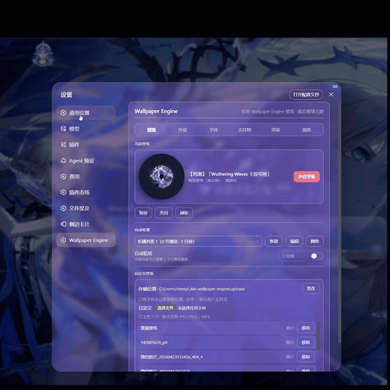
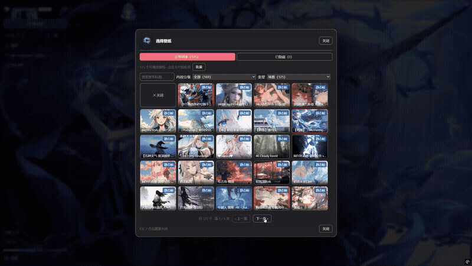
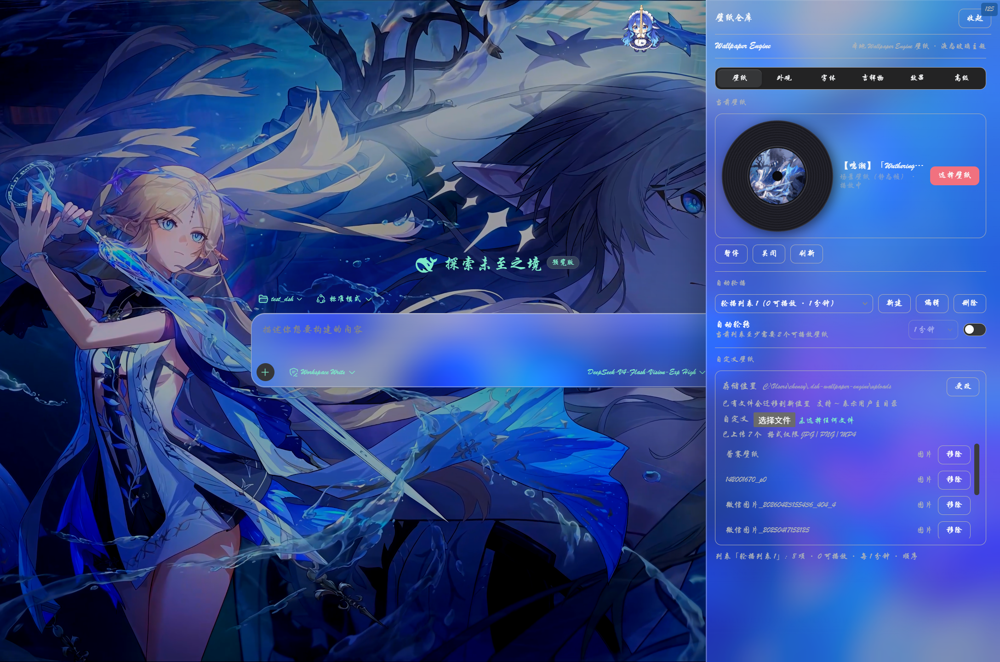

# dsh-plugin-wallpaper-engine

 

[English](README.en.md) | [中文](README.md) | [Beginner guide](README.beginner.md#english)

> 🆕 **Never used the command line? Start here: [beginner-friendly guide →](README.beginner.md)** (a simplified walkthrough in Chinese for users who have never touched a terminal).

A DSH bundle that turns your **Wallpaper Engine** wallpapers into the **background of the DSH web GUI** (`dsh web`).


> Wallpaper + scrim + iOS liquid glass rendered behind the DSH GUI.

## Contents

- [What it does](#what-it-does) · [Prerequisites for updating](#prerequisites-for-updating) · [Which wallpaper types are supported?](#which-wallpaper-types-are-supported) · [How it works](#how-it-works)
- [Install](#install) · [Usage](#usage) · [Configuration](#configuration) · [dsh-better-sidebar compatibility](#dsh-better-sidebar-compatibility) · [Limitations](#limitations) · [Development / rebuild](#development--rebuild)
- Version numbers, issue numbers and benchmark figures live in [`docs/CHANGELOG.md`](docs/CHANGELOG.md); update prerequisites in [`docs/UPGRADING.md`](docs/UPGRADING.md).
- 📦 The npm package ships **only the three READMEs** (`docs/` is not published) ⇒ those `docs/…` links do not resolve on npm / in the plugin market; read them in the **source repository** <https://github.com/elysia395/dsh-wallpaper-engine> at the same paths.

## What it does

It discovers the Wallpaper Engine install on your machine, lists your wallpapers, and renders the *portable* types into a fixed layer **behind** the DSH chat interface, wrapped in an iOS-style **liquid glass** UI makeover.

> Version numbers, issue numbers and benchmark figures all live in [`docs/CHANGELOG.md`](docs/CHANGELOG.md).

**Wallpaper rendering (core)**

- **Three wallpaper types, three render paths**: **Video** plays directly; **Web / HTML** runs through the built-in WebWallGL web mount (host-injected WE API + strict sandbox isolation); **Scene** is rendered by the built-in **WebWallGL** real-time WebGL engine — particle systems, puppet skeletal models, SceneScript, mouse parallax and click interaction, packaged audio and audio reactivity.
- **Live first, graceful degradation**: the renderer page is watched by a **heartbeat watchdog**, so a first-frame timeout or a stalled runtime degrades through 「embedded MP4 → live-captured frame → custom frame → empty state」 and is remembered per wallpaper (re-toggling the switch retries). **No black screen before the first frame**: the placeholder takes 「live-captured frame → the author's own preview image (the thumbnail WE shows) → the theme colour」 — a preview is only a stand-in, never "guessing a picture on the author's behalf"; only when none of them can be read does it stay **honestly empty**.
- **High-fps sources can shed load**: the **fps cap** transcodes a source such as 4K120 once to the capped frame rate (4K preserved + AV1) — measured GPU usage drops from ~60 % to **~15 %**; the **occlusion-pause** trio drops the decoder entirely on minimize / focus loss / battery.
- **What can move over, moves over**: upload local JPG / PNG / MP4 straight from the picker; user-defined rotation lists switch wallpapers on their own interval and order (only once the next one is ready — no black flash).

**UI makeover (core)**

- **Liquid glass across the whole settings window**: the entire native DSH settings window (dialog + left nav + every native section) becomes liquid glass, with accent color, glass base tint, transparency and blur all adjustable.
- **Text surfaces keep a floor**: every text-bearing surface composites a theme base layer underneath, worst-case body-text contrast **4.63:1** — no slider extreme can make text illegible.
- **Typography and caret, refined**: fonts are tunable per **color role / typographic role / component** (size, weight and family each), with an independent color for the input caret.
- **Wallpaper-to-UI blending**: wallpaper blur, brightness / contrast / saturation, wallpaper opacity, scrim, border and glass blur — all applied instantly.

**Signature features**

- **Mascot**: a draggable **pull-cord** at the top of the chat that slides out the **wallpaper library** drawer (two artworks, resizable), with quick adjustments always within reach.
- **Sidebar liquid glass**: a dedicated adaptation for `dsh-better-sidebar`'s panels (frost, highlight and layer hierarchy unified), plus its own set of sidebar glass controls.

## Prerequisites for updating

> ⚠️ **Update the DSH kernel and `dsh-better-sidebar` first — the order cannot be reversed** (updating this plugin first hits an incompatible API). The full version matrix, the three steps and "what to do if you got the order wrong" are in [`docs/UPGRADING.md`](docs/UPGRADING.md).

## Which wallpaper types are supported?

Wallpaper Engine itself splits wallpapers into four types; this plugin supports three of them:

| Type | Rendered by | Portable to DSH? |
|---|---|---|
| **Scene** | Wallpaper Engine's own 3D engine | ✅ Live — the built-in WebWallGL WebGL engine (particles / scripts / parallax / packaged audio); degrades through the out-figure chain on failure |
| **Web** | Wallpaper Engine's built-in HTML/JS runtime | ✅ Live — WebWallGL's web mount with the **injected WE API** (audio / property / media listeners) under a strict sandbox; falls back to a plain iframe on failure |
| **Video** | Wallpaper Engine's built-in player | ✅ Direct playback — the same hardened pipeline as uploaded video (transcode, fps cap, occlusion pause, speed / flip) |
| **Application** | Wallpaper Engine launches a third-party executable | ❌ **Not supported** — it needs the host to run an external program, which this plugin does not offer |

> The render path, graceful degradation, out-figure chain and empty-frame gate for all four types — plus the
> diagnostics rows used for troubleshooting — are in [`docs/HOW-IT-WORKS.md`](docs/HOW-IT-WORKS.md).

## How it works

In one line: the **host** (`lib/index.js` + `lib/routes/*.js`) locates Wallpaper Engine and your library
and feeds media to the browser; the **client** (`lib/client.js`) mounts the selected wallpaper as a fixed
layer *behind* the app's three columns and registers a first-level "Wallpaper Engine" settings tab.

> The out-figure chain (live render → embedded MP4 → live capture → custom frame → empty state), the
> host/client split, the full HTTP route table and the design reason for "no CPU fallback image" all live in
> [`docs/HOW-IT-WORKS.md`](docs/HOW-IT-WORKS.md). **Implementation details are the code comments.**

## Install

### For users (published version, recommended)

If you simply want to use the plugin, install the published package from npm:

```sh
dsh plugin --profile web add dsh-plugin-wallpaper-engine
```

Then restart `dsh web` and open **Settings → Wallpaper Engine**.

> **macOS users**: Wallpaper Engine has no macOS client. The macOS line of this
> plugin (WaifuX + loose-media support) is maintained by Jerry and published as
> a separate npm package:
>
> ```sh
> dsh plugin --profile web add dsh-plugin-wallpaper-engine-mac
> ```
>
> Repo: https://github.com/ruijiaang-lab/dsh-wallpaper-engine

### For developers (running your own copy)

Installing a local copy with `link:`, building and verifying, hot-mount rules and the encoding rules
(including **what `lib/client.js` actually is**) are documented in [`CONTRIBUTING.md`](CONTRIBUTING.md).
**Host-side changes need a DSH restart to take effect** (CLI installs use `--profile web`; the desktop app
uses `--profile desktop` and must be **fully closed first**).

### Troubleshooting install failures

Step-by-step recovery (`ERR_PNPM_UNEXPECTED_VIRTUAL_STORE`, etc.) lives in
[`docs/TROUBLESHOOTING.md`](docs/TROUBLESHOOTING.md).

## Usage

1. Open `dsh web` → the DSH GUI.
2. Open **Settings** and pick **Wallpaper Engine** from the left navigation (a first-level settings page, its own nav entry); the **pull-cord mascot** at the top of the chat also slides out the wallpaper-library drawer — both share one set of tabs and controls.
3. Click **选择壁纸** to open the picker modal, then click a wallpaper in the thumbnail grid (**Application** wallpapers are not supported and stay out of the grid); close the modal via the backdrop, ESC, or the close button.
4. Use **暂停/播放** to control a video wallpaper and **关闭** to clear it. Every choice and adjustment applies instantly and persists (see [Configuration](#configuration)).



> The settings page: the liquid-glass card with six tabs (壁纸 / 外观 / 吉祥物 / 效果 / 声音 / 高级).



> The picker modal: browse every wallpaper thumbnail, batch-hide, and restore from the hidden tab.

### The settings tabs

The settings page and the wallpaper-library drawer share the same **six tabs** — **壁纸** (selection / rotation / custom) · **外观** · **吉祥物** · **效果** · **声音** · **高级** — each keeping only the controls that belong to it instead of a thirty-item single column. The pill indicator slides smoothly between tabs, and long explanations live in tooltips — each row keeps a one-line hint.

### Selection & filters

- **Hide / restore**: the **隐藏** button in a card's top-right corner only removes the wallpaper from the list — it **never touches the source file**. The modal's **已隐藏** tab restores one or all of them, and **批量** enters multi-select mode. Hiding the wallpaper that is currently playing does not interrupt it, and automatic rotation skips hidden wallpapers.
- **Content rating**: reads each wallpaper's `contentrating` field (WE wallpapers: `project.json`; uploads: `uploads/.meta.json`) — **全部 / Everyone (default) / PG13 / Mature / 未分级**; an upload without a rating counts as **Everyone**. The plugin scans the disk itself and does **not** follow the adult-content switch inside the Wallpaper Engine client.
- **Type**: filters by the embeddable type — **全部 / 视频 / 网页 / 图片 (uploads) / 场景 (scenes)**.
- Every option shows how many playable wallpapers currently match; filtered-out wallpapers are dropped from the grid, the rotation editor and the rotation candidates — they are never auto-selected or rotated.

### Card style & playback controls

- **紧凑布局 (compact layout)**, a toggle in the **高级** tab: ON gives the **CD-rack** look — cards stack vertically, hovering scales a card up and brings it to the front, and the grid shows everything on ONE page; OFF is the regular grid (default).
- **黑胶唱片 (vinyl record)**: a rotating vinyl next to the picker uses the selected wallpaper's cover as the record label — it spins while the wallpaper plays and stops when paused; it shows in both card styles.
- **Playback speed**: 0.5x / 0.75x / 1x / 1.25x / 1.5x / 2x for video wallpapers, driven by the browser's native `playbackRate` — instant, no reload, no black flash.
- **Horizontal flip**: mirrors video, web and uploaded images / videos via CSS `scaleX(-1)` — zero main-thread cost.
- **Switch transitions**: the animation used when the wallpaper changes (shared by manual picks and automatic rotation) — **hard cut (default)** / cross-fade / push / wipe / iris / zoom / strips, each with its own baseline duration multiplied by fast / normal / slow, plus a direction for the directional ones; under `prefers-reduced-motion` every transition degrades to a hard cut.

### Power saving & load shedding

The **遮挡暂停 (occlusion pause)** trio in the **高级** tab (defaults: minimize / tab-switch **on**, focus loss **off**, on battery **off**): when a condition hits, video wallpapers **stop decoding outright** (an explicit `pause`, not browser throttling — the decoder drops to zero) and the scene live render pauses its render loop; playback resumes when you come back / plug in (a manual pause is never auto-resumed).

The **帧率上限 (fps cap)** control in the **效果** tab (unlimited / 60 / 48 / 30 / 24 fps) targets high-fps sources: the host re-encodes the source ONCE with ffmpeg to the capped frame rate (the timeline stays **1.0x normal speed**, fully decoupled from playback speed) as **4K-preserving AV1**, cached so each wallpaper pays the cost once. The original plays first and the app swaps when the transcode is ready; the settings page shows a **live progress bar**; a source already within the cap is skipped and a failed transcode falls back to the original.

> ffmpeg is provisioned in three tiers: **explicit** (`DSH_WE_FFMPEG`, or an `ffmpeg/` folder inside the plugin) → **auto-download** (npmmirror vs GitHub dual-source race, cached after verification) → **system PATH**. The encoder prefers **NVENC** (`av1_nvenc` → `h264_nvenc`) and falls back to **libx264 software encoding** when there is no NVIDIA GPU (slower, but it still produces the file); only a total lack of ffmpeg auto-disables the feature, leaving the wallpaper on the original with nothing else affected.

### Picture adjustments

The **效果** tab (available while a wallpaper is active) and the **细节** group of the **外观** tab offer eight sliders: **壁纸模糊** · **亮度 / 对比度 / 饱和度** (wallpaper media filter) · **壁纸透明度** (fades the whole layer toward the page base colour, complementing **暗化**) · **暗化** (scrim between wallpaper and text) · **边框** (border / divider contrast) · **雾化** (glass-panel blur radius). All apply instantly and persist — **no page refresh needed**; every control shows its own range and default.

> **No single theme fits every wallpaper** — switch DSH between light and dark to find the one that suits the current wallpaper; if text or hairlines become hard to read on a bright or busy wallpaper, raise **暗化 / 边框** (plus a little **壁纸模糊**), and if the wallpaper is too loud, raise **壁纸透明度**. No slider extreme can push body text below legibility — text-bearing surfaces keep a **readability floor** (see above).

### Live rendering & wallpaper properties

Scene / web wallpapers render live through the bundled **WebWallGL** engine by default (`lib/webwallgl/`, MIT, from [webwallgl](https://github.com/oneincase/webwallgl)): particle systems, puppet models, SceneScript, mouse parallax / click interaction, packaged audio and audio reactivity. The renderer page runs in a **same-origin isolated iframe** under a **heartbeat watchdog**; failures are remembered per wallpaper and degrade automatically (re-toggling the switch retries). Web wallpapers additionally get the **injected WE API** (audio / property / media listeners) and a forced `sandbox="allow-scripts"` — third-party HTML never inherits the DSH origin.

When the current wallpaper is a **scene** or **web** wallpaper, the current-wallpaper card shows a green **壁纸属性** button: it lists the adjustable properties the author defined in the WE editor (color / bool / slider / combo / text / file), applies a change **immediately** and **remembers it per wallpaper**, and **恢复默认** clears every edit for that wallpaper. The panel shows the values **actually in effect** (read back from the renderer).

### Custom wallpapers & automatic rotation

- **Custom wallpapers**: upload local **JPG / PNG / MP4** as wallpapers (validated twice — in the browser and on the host). The **storage location** defaults to `~/.dsh-wallpaper-engine/uploads` and can move to any drive (absolute path, `~` supported) with existing files migrated automatically; the **fit modes** are cover / contain / center / fill. Uploaded MP4s get an on-demand extracted thumbnail, and re-uploading an identical file is detected by content and reuses the existing entry.
- **WE project directories**: any project folder containing `project.json` (with `scene.pkg` / `index.html` / `*.mp4`) inside the storage location is picked up as a wallpaper of the matching type — scene wallpapers render live too. These folders are **read-only**: they never appear in upload management and are never deleted.
- **Automatic rotation**: rotation runs over **user-defined carousel lists** — create any number with **新建**, pick wallpapers into each from the inventory, give each list its own **switch interval** (1 / 5 / 10 / 30 / 60 / 120 minutes) and **order** (sequential / random), then enable **自动轮转** on the list you want active. Each list needs at least two playable wallpapers; on first run the first playable WE playlist is imported as a list, and **从 WE 播放列表导入** imports any other playlist while editing.
- **Switch when ready**: the next wallpaper is prepared in the background to **fully ready** (live first frame / video canplay / image decoded) before the commit — the current wallpaper keeps playing meanwhile, and the two layers cross-fade at the moment of readiness, so the new picture is alive on arrival with no black flash; a candidate that fails to prepare is skipped in a bounded chain.

### Liquid-glass appearance (whole settings window + accent + transparency)

The **外观** tab controls the look of the **entire native DSH settings window** (following the dsh-web-ui-all skin-center design):

| Control | What it controls | Default |
|---|---|---|
| **设置窗口液态玻璃** | Master switch: turns the whole settings window (dialog + left nav + every native section) into liquid glass | on |
| **配色** | Theme color: buttons, switches, links, nav active, sliders and glass highlights inside the window all follow it (6 presets + custom picker) | classic blue `#4f8cff` |
| **玻璃颜色** | The **base tint** of the settings-window glass (6 presets + custom picker) | white (light) / deep navy (dark) |
| **玻璃透明度** | Opacity of the glass surfaces (settings window, composer, bubbles, sidebar panels); higher = more transparent | 12 % |
| **雾化** | Glass blur radius — **the same adjustment** drives the settings window and the composer / bubbles | 16 px |
| **Text-surface readability floor** | Every text-bearing surface composites a theme base layer under the glass tint (body text stays ≥4.5:1); **on by default, no switch** | on |

Everything applies instantly and persists; browsers without `backdrop-filter` fall back to a high-opacity solid so text stays readable.

### Mascot (chat pull-cord)

The **吉祥物** tab controls the chat **pull-cord** — a draggable rope pinned to the top edge; pulling it down slides out the **wallpaper library** drawer (vinyl card, rotation and custom-wallpaper management within reach). The **form** picker renders as cards: each card draws the actual artwork scaled by the current **吉祥物大小** slider, so choosing a form and judging its size happen in one place:

| Control | What it does | Default |
|---|---|---|
| **显示吉祥物** | Whether the pull-cord mascot and its wallpaper-library drawer render | on |
| **吉祥物形态** | Switches artwork: **小女仆** (near-square chibi) or **鲸御姐** (portrait 2:3 full-body) | 小女仆 |
| **吉祥物大小** | Scales the mascot (the rope box follows the ratio; drag / snap geometry adapts automatically) | 1× |



> Pull the top rope mascot to slide out the wallpaper-library drawer. Both artworks are inlined as base64 (transparent background) at build time, so the single-file client bundle stays self-contained; **size** changes only the rope's own box, never the drawer below.

### Typography & input caret

Two independent groups in the **外观** tab:

- **Global typography** — the **master switch defaults to off** (the stock dsh look). Once enabled, everything is refined **per role / per component** (**there is no global weight and no global font family** — a single global value flattens DSH's weight and family hierarchy):
  - **Text color roles**: tint each of DSH's **color roles** separately (unset = keep the DSH default);
  - **Typographic roles**: one row per role with **size / weight / family** — size is an **absolute px** value (the box shows DSH's official size; empty = leave it alone), weight is 100–900, family is a 7-option picker ("follow" = do not override), plus a "changed only" filter;
  - **Advanced font settings** (sub-switch): refine **code blocks / terminal / markdown / tables** **per component** — effective only for components found by the startup self-probe (if DSH renames one, that entry degrades instead of misfiring).
  Error / danger / warning elements keep their system red; **恢复默认** clears every typography override.
- **Input caret** — when the wallpaper shows through the liquid-glass composer and the caret blends into it ([#83](https://github.com/elysia395/dsh-wallpaper-engine/issues/83)), this group gives the caret its own color: **自动** (default, native dsh) / 6 presets / custom picker, applied via `caret-color` to every text input.

### System-audio reaction and Now Playing

Three controls in the **声音** tab (the first two on by default, the third off):

- **系统音频反应** — feeds a spectrum of **whatever the system is playing** (any app, not just browser tabs) to the wallpaper's audio-reactive effects. It is the system-output **loopback**, not the microphone, and it is built in on all three platforms (WASAPI loopback on Windows — **no "Stereo Mix" or virtual sound card needed**); when no audio can be captured the wallpaper falls back to its built-in simulated spectrum.
- **媒体信息** — hands the system **Now Playing** (title / artist / album / playback / position / duration / **cover art**) to the wallpaper through the official WE APIs `wallpaperRegisterMediaPropertiesListener` / `…ThumbnailListener` / `…PlaybackListener` (plus `…TimelineListener`), so workshop web wallpapers that recognise them show song info and artwork.
- **在线歌词** — lyrics come from local sources first (a `.lrc` next to the audio file, or an already-cached copy); when enabled, a missing lyric triggers one query to [lrclib.net](https://lrclib.net) — that request sends title / artist / album, hence **off by default**.

> This data comes from a bundled Rust middleware, [media-bridge](https://github.com/oneincase/media-bridge), run as a child process (downloaded on first use, sha256-verified, cached under `~/.dsh-wallpaper-engine/bin/`): MediaRemote on macOS, the system media session (GSMTC) on Windows, MPRIS over D-Bus on Linux. So `brew install media-control`, `playerctl`, VB-Cable and Xcode Command Line Tools are all no longer needed; when the middleware cannot be fetched or started, the plugin falls back to its built-in implementation and reports the reason in `GET /wallpaper-engine/media-status` (`fallback`).

## Configuration

This plugin exposes no model-visible tools or prompt text — **zero token cost** for the agent — and writes no DSH settings of its own. Only three things land on disk: the host-side config file `~/.dsh-wallpaper-engine/config.json` (every setting — selection, hidden list, rotation, accent, typography, … — plus your chosen upload directory), the **custom wallpaper files** themselves, and the **caches plus on-demand runtimes** under `~/.dsh-wallpaper-engine/` (transcode / live-frame / video-thumbnail caches, the ffmpeg and media-middleware binaries).

**Environment variables**:

| Variable | Purpose |
|---|---|
| `DSH_WE_FFMPEG` | explicit ffmpeg executable path (highest priority in the resolution chain) |
| `DSH_WE_FFMPEG_URL` | replaces the auto-download source (self-hosted mirror / proxy) |
| `DSH_WE_CACHE_DIR` | overrides the cache root (transcode cache / live-frame cache) |
| `DSH_WE_STEAM_ROOT` | explicit Steam root(s) (comma/semicolon separated, Windows or /mnt paths; fallback when registry/auto-detection misses) |
| `DSH_WE_MEDIA_BRIDGE` | explicit media-middleware executable (dev/self-built artifact; highest priority) |
| `DSH_WE_MEDIA_BRIDGE_URL` | replaces the middleware download source (`{tag}` / `{asset}` placeholders supported) |
| `DSH_WE_MEDIA_BRIDGE_TAG` / `DSH_WE_MEDIA_BRIDGE_SHA256` | use another middleware version (an unpinned tag is refused unless you supply its sha256) |
| `DSH_WE_MEDIA_LEGACY` | `=1` forces the built-in implementation (for A/B debugging) |
| `DSH_WE_MEDIA_NO_AUDIO` | `=1` metadata only — never touches system audio capture (no permission prompt) |
| `DSH_WE_MEDIA_PROVIDER` | `=mock` runs the middleware's built-in fake player (no real player needed) |
| `DSH_WE_MEDIA_IDLE_MS` | idle ms before the middleware child is stopped (`0` = never; default 15 min) |
| `DSH_WE_MEDIA_DEBUG` | `=1` logs the middleware's stderr and spawn arguments |
| `DSH_WE_DATA_DIR` | overrides the plugin data directory (default `~/.dsh-wallpaper-engine`; self-check scripts use it so they never touch your real `config.json`) |
| `DSH_WE_UPLOAD_DIR` | overrides the custom-wallpaper storage location (takes priority over the in-app 更改 setting and the default) |
| `DSH_WE_ASSETS_DIR` | overrides the official-assets path (the WE `assets` tree; takes priority over the in-app setting) |
| `DSH_WE_TRANSCODE_TIMEOUT_MS` | overrides the wall-clock budget for one transcode job (ms; default 15 min) |

**Where settings live**: since v0.4.0 every setting lives in the host-side file `~/.dsh-wallpaper-engine/config.json`
(independent of the browser's port, so a restart / port change / cleared browser data cannot lose it; legacy
localStorage settings are migrated automatically). File location, multi-device sharing and write behaviour: see the
"Settings persistence" section of [`docs/UPGRADING.md`](docs/UPGRADING.md).

## dsh-better-sidebar compatibility

The liquid-glass effect is specifically adapted for dsh-better-sidebar's panels
(frost, specular highlight, and layer hierarchy are unified), so the sidebar and
the conversation area share the same wallpaper + scrim background and read as one
continuous surface.

The **外观** tab also exposes a set of **sidebar glass** controls independent of
both the conversation glass and the active wallpaper. Even with no Wallpaper
Engine wallpaper selected, the sidebar can be tinted and frosted over the stock
DSH surface or another background source. These controls target only the
dsh-better-sidebar subtree; browsers without `backdrop-filter` fall back to a
near-opaque fill:

| Control | What it controls | Range | Default |
|---|---|---|---|
| **侧栏液态玻璃** | Master switch: frost the sidebar panels | On / off | On |
| **侧栏模糊** | Blur radius of the sidebar frost | 0–200 px | 16 |
| **侧栏透明度** | Sidebar glass density (**higher = clearer**: 0 densest / 200 clearest) | 0–200 % | 120 % |
| **侧栏玻璃颜色** | Sidebar glass **base tint** | 6 presets + custom picker | `#ffffff` white |

> Sidebar glass is a separate set of knobs from the settings-window glass: the
> conversation 「玻璃」slider only drives the composer / bubbles, while the sidebar
> sliders drive the sidebar. Turning **侧栏液态玻璃** off restores the native
> sidebar, including its editor / terminal content surfaces. The sidebar defaults
> to a fairly clear glass (so it matches the background instead of glowing
> white); editor / terminal content surfaces have their own near-opaque fill +
> transparency controls to keep text readable in the narrow panels.


> The sidebar glass adaptation with the custom typography (行楷) applied at the same time.

## Limitations

- **Application wallpapers are not supported** — they need the host to run a third-party executable, which this plugin does not offer — so they stay out of the thumbnail picker and the rotation candidates. **Scene** wallpapers are rendered live by the bundled WebWallGL engine and need no Wallpaper Engine process running in the background.
- The browser must be able to autoplay muted `<video>` (DSH runs on loopback; muted autoplay is allowed by modern browsers).
- Media is served from your local Wallpaper Engine install paths; the host only serves files it has already enumerated (no arbitrary filesystem exposure). Custom uploads likewise stay on your machine — nothing is uploaded to any server.
- **The fps cap depends on ffmpeg**: the encoder prefers NVENC (`av1_nvenc` → `h264_nvenc`) and falls back to **libx264 software encoding** without an NVIDIA GPU (slower, still works); only a missing ffmpeg (including an unavailable auto-download, e.g. musl/Alpine or other uncovered platforms) auto-disables the fps cap, leaving wallpapers on the original — nothing else is affected.
- **Occlusion pause applies to video wallpapers and the scene live render**: videos pause their decoder directly; the scene live render pauses its render loop through the control surface (GPU usage drops with it). Plain web (iframe) wallpapers cannot be paused from outside and are only throttled by the browser when hidden.
- The picker is English/Chinese mixed (this bundle is not yet wired into DSH's locale namespaces).

## Development / rebuild

Running your own copy (`link:` install, build & verify, hot-mount and encoding rules, and **what
`lib/client.js` actually is**) is documented in [`CONTRIBUTING.md`](CONTRIBUTING.md).
