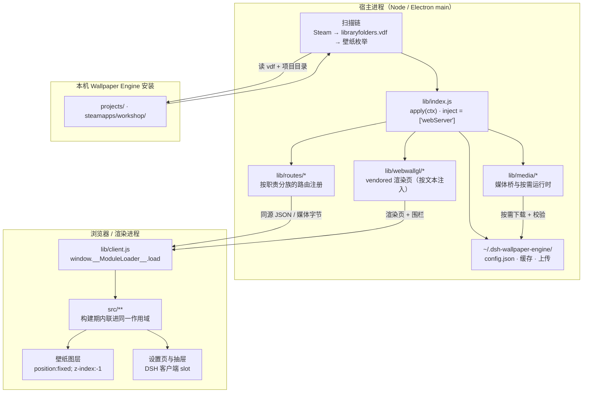
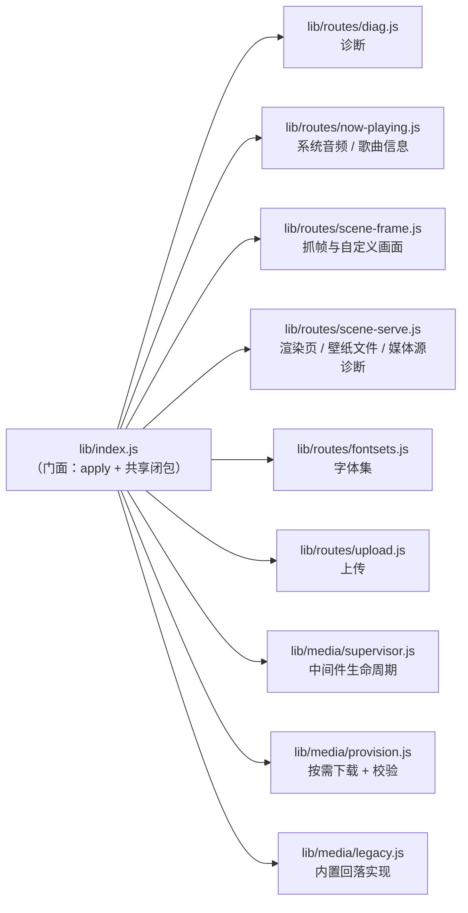
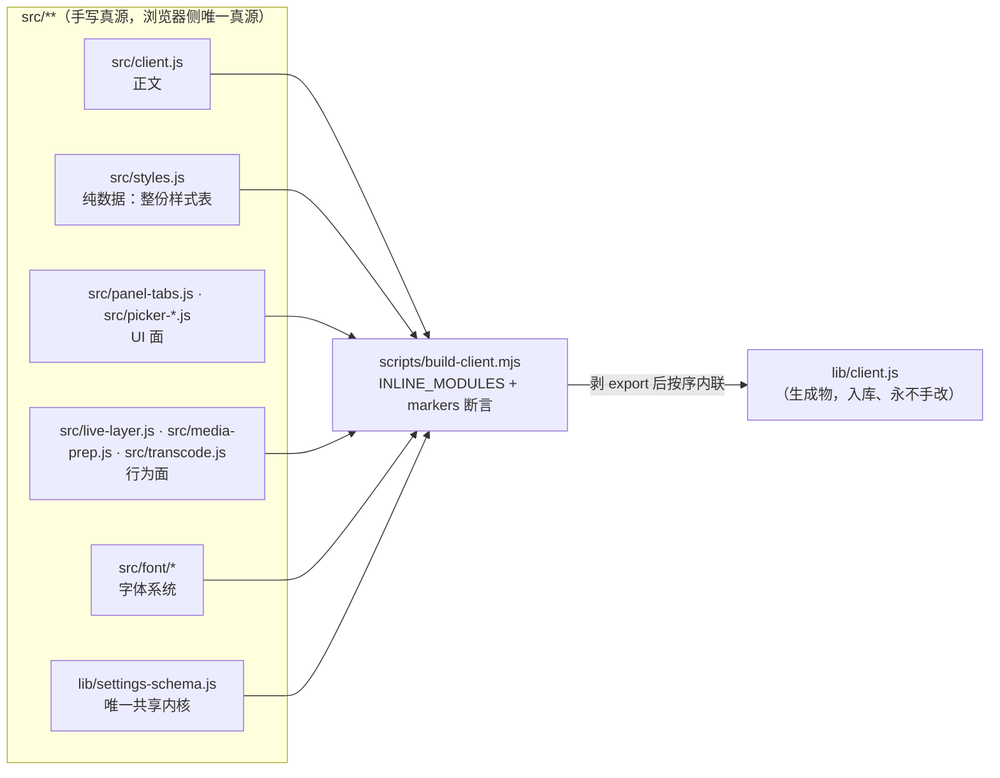
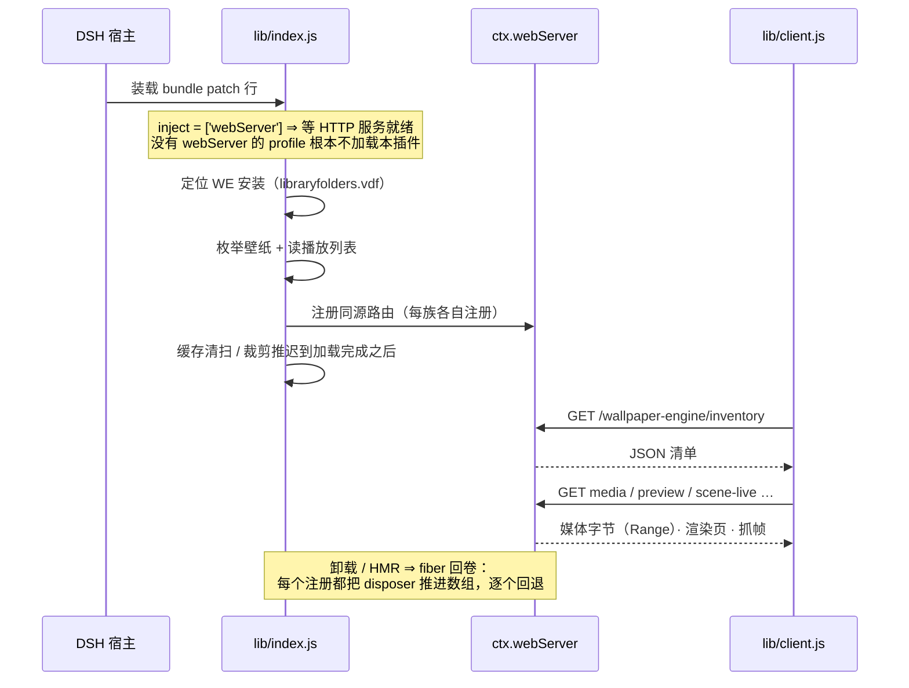
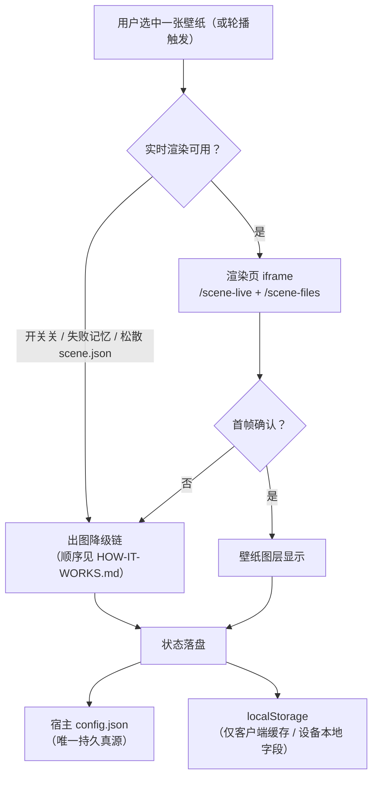

# 架构总览（Architecture）

> **本文只画结构：谁跑在哪、谁调用谁、数据往哪流、状态住哪。**
> **不写实现细节**（那些在对应文件的头注释里）、**不写会漂的数值**（条数 / 行数 / 体积 / 耗时阈值
> 一律给复算方式，见 [`README.md`](./README.md) §写作纪律 4）。
> **为什么这么选**写在 [`adr/`](./adr/) 里 —— 本文只描述"是什么"，"为什么"不在这里。

## 读者路径

| 你想知道 | 读哪里 |
|---|---|
| 用户可见行为、出图降级链、路由表 | [`HOW-IT-WORKS.md`](./HOW-IT-WORKS.md) |
| **结构全貌：进程 / 分层 / 数据流 / 状态 / 生命周期** | **本文** |
| 某个设计为什么是这样 | [`adr/`](./adr/) |
| 新文件放哪、两侧怎么互通 | [`MODULE-LAYOUT.md`](./MODULE-LAYOUT.md) |
| 加一个功能 / 加一条守卫 | [`DEV-GUIDE.md`](./DEV-GUIDE.md) |
| 跑测试、写测试 | [`TEST-LAYOUT.md`](./TEST-LAYOUT.md) |
| 权限与升级 | [`UPGRADING.md`](./UPGRADING.md) · [`TROUBLESHOOTING.md`](./TROUBLESHOOTING.md) |

---

## 1. 一份代码，两个半边

本插件是**一个 npm 包**，但它同时是两种东西：

| 身份 | 入口 | 谁加载它 | 跑在哪 |
|---|---|---|---|
| **Cordis 宿主插件** | `lib/index.js` 的 `inject` / `apply(ctx)` | DSH 宿主按 bundle patch 行装载 | Node（Electron 主进程侧） |
| **DSH 客户端插件** | `lib/client.js`（`exports["./client"]` + `package.json` 的 `dsh.client` 清单） | DSH **客户端加载器**按包元数据取（宿主不提供任何路由发它） | 浏览器 / 渲染进程 |

**两条加载路径互不知道对方的存在** —— 它们唯一的耦合是**约定好的同源 HTTP 路由**
（宿主注册、浏览器 fetch）。这条边界是整个架构里最重要的一条：

> 两条路径的**唯一接口**是 HTTP 路由表。因此路由表是**生成物**（`docs/ROUTE-INDEX.md`，
> 由 `test/tools/host-route-index.mjs` 重算并逐字节核对）—— 手写必烂，本仓已有过教训。

---

## 2. 宿主半边：门面 + 路由族

`lib/index.js` 是**门面**：它做注册与协议聚合，**不装新逻辑**。随着功能增长，成族的职责被抽成模块：

**族的形态有明文规定**（`MODULE-LAYOUT.md` §4）：路由模块从 `apply(ctx)` 拿一个**显式 context 对象**
（字段就是它用到但不属于它的东西），而不是继承 `lib/index.js` 的 import。这条边界由守卫
`verify-module-layout` 的『路由模块不得"继承" lib/index.js 的 import』一节钉住。

**为什么门面不拆干净**：一部分共享可变状态（媒体源地址、载荷账本、缓存索引）必须与 `/inventory`
同作用域。因此门面仍持有一组闭包状态，跨模块只能以**访问器**形式出去 —— 传值就是陈旧快照。

---

## 3. 浏览器半边：构建期内联，不是模块系统

浏览器半边的真源是 `src/**`，但**运行时没有本地模块解析器**（加载器的 `require` 只服务外部包）。
因此拆出去的模块由 `scripts/build-client.mjs` 在**构建期**按 `INLINE_MODULES` 清单
剥掉 `export` 后注入 `lib/client.js` 的**同一个工厂作用域**。

要点（各条都有守卫或构建期断言兜住）：

- **浏览器 bundle 没有 `import`**：`src/**` 模块之间靠"同一作用域"协作，靠模块头的**契约**表达依赖。
- **清单必须与目录一一对上**：漏登记**不会报错**，只是那个文件永远不进产物（本仓踩过一次）。
- **`markers` 是防"拆分悄悄变空"的锚点**：缺任一标记即构建硬失败。
- **产物入库**：支持的安装路径（`pnpm add github:` / `link:`）都不跑构建，所以产物必须随包。

详细取舍见 [`adr/0003`](./adr/0003-build-time-module-inlining.md)。

---

## 4. 启动与生命周期

- **`webServer` 是硬依赖**：声明在 `inject` 上，由 Loader 等待 —— 无 HTTP 服务的 profile
  **不加载**本插件，而不是加载后崩溃。
- **一切注册都经 fiber**：路由、媒体源、定时器、子进程都在卸载时回退。这条不是可选的 ——
  否则卸载 / HMR 后会留下挂着的处理器。
- **`ctx.webServer` 仍防御性读取**：路由表建不起来时要有明确失败，而不是 undefined 崩。

---

## 5. 一次壁纸的生命周期（数据流）

> **降级链的成员与顺序只在 [`HOW-IT-WORKS.md`](./HOW-IT-WORKS.md) 定义一处** —— 本文只把它当
> 一个结构节点画出来，**不复制它的步骤**（复制一份就会在下一次调整降级顺序时漏改一处）。

**关键结构性质**：

- **降级是链式的，不是二元的**：任何一级失败都有下一级接手，最后一级允许"诚实留空"。
- **失败记忆分两层**：**共享设置**（所有窗口共用，会被落盘）与**会话内软失败**（不落盘）。
  传输类失败只进后者 —— 一次被饿死的传输不该变成每个窗口的永久降级。
- **隐藏 / 未播放的实例根本不拉载荷**：建层时延迟赋 `src`、切后台摘成 `about:blank`，
  否则它会和看得见的那个抢带宽与解码器。

---

## 6. 状态住哪（唯一真源清单）

| 状态 | 真源 | 谁读 | 结构 |
|---|---|---|---|
| **设置的全部键**（默认值 / 范围 / 枚举） | `lib/settings-schema.js` | 宿主 **和** 客户端 | 构建期内联给浏览器（唯一共享内核） |
| **持久化的值** | 宿主 `config.json` | 宿主写、客户端经 inventory / 保存接口 | 客户端 localStorage 只是缓存 |
| **路由表** | `docs/ROUTE-INDEX.md`（生成物） | 人 + 守卫 | 由 `test/tools/host-route-index.mjs` 复算 |
| **构建期内联清单** | `scripts/build-client.mjs` 的 `INLINE_MODULES` | 构建 + 守卫 | 带 `markers` 锚点 |
| **发布面** | `package.json` 的 `files` | 守卫 P1–P7 | 留在 `lib/` 的一切都会被打进包 |
| **退役线 / 死码基线** | `test/verify-retired-lines.mjs` · `test/verify-reachability.mjs` | 守卫 | 只许缩小 |

> **文档一律不抄这些值**。想知道当前值：设置看 `lib/settings-schema.js`，路由看生成物，
> 条数看 `package.json` 的 scripts —— 抄一份就是多一个无人复算的副本。

---

## 7. 扩展点（加东西时落在哪）

| 要加什么 | 落在哪 | 还必须在哪登记 |
|---|---|---|
| 一条宿主路由 | `lib/routes/<族>.js`（成族才单独成文件，否则就近） | 路由索引由生成器自动重算 |
| 一个设置项 | `lib/settings-schema.js` 的 `DEFAULTS` + `KINDS` | 面板读取即可，**不要另写一张 UI 表** |
| 浏览器端一块 UI / 行为 | `src/<语义名>.js` | `scripts/build-client.mjs` 的 `INLINE_MODULES`（**漏登记静默失效**） |
| 字体相关 | `src/font/`（子目录有准入门槛） | 见 [`FONT-SYSTEM.md`](./FONT-SYSTEM.md) |
| 随包的数据文件 | `lib/<语义名>/` | `package.json` 的 `files`（P1 会判） |
| 一条守卫 | `test/`（守门）或 `test/tools/`（手动工具） | 视档位挂进 `verify` / `verify:docs` |

**一句话**：*读代码的守卫照留，读文档散文的守卫不加*；数值一律指向真源，不抄进文档。

---

## 8. 分层与边界（为什么这样切）

| 边界 | 规则 | 由什么兜住 |
|---|---|---|
| 宿主 ↔ 浏览器 | 只经**同源 HTTP 路由**；浏览器半边不得 `import` 宿主代码 | 无本地模块解析器（结构上不可能） |
| `lib/` → `src/` | **禁止**：`lib/**` 不得 import `src/**`（依赖方向单向） | `verify-module-layout` ②（零容忍） |
| 发布面 | 留在 `lib/` 的一切都会被发布 ⇒ 死码不许留 | `verify-package-files` · `verify-reachability` |
| 门面 | `lib/index.js` 只做注册与协议聚合，不装新逻辑 | `verify-module-layout`『路由模块不得继承门面 import』 |
| 注释与文档 | 机制写文件头、决策写 ADR、数值指向真源 | **约定**（无守卫，见 [`adr/0006`](./adr/0006-comment-discipline-as-written-convention.md)） |
