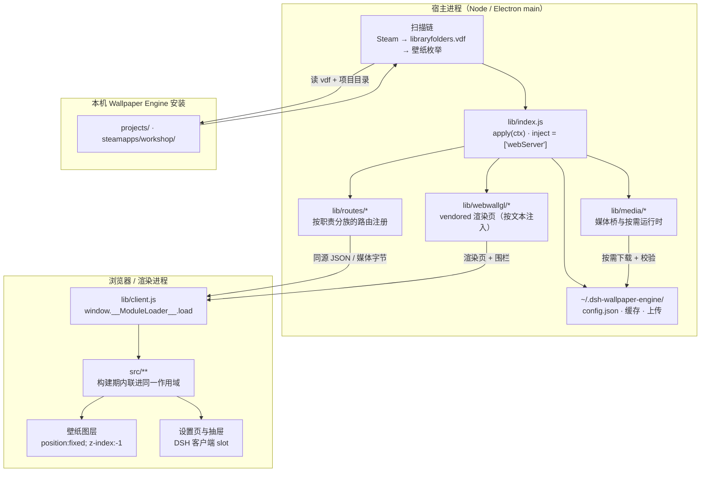
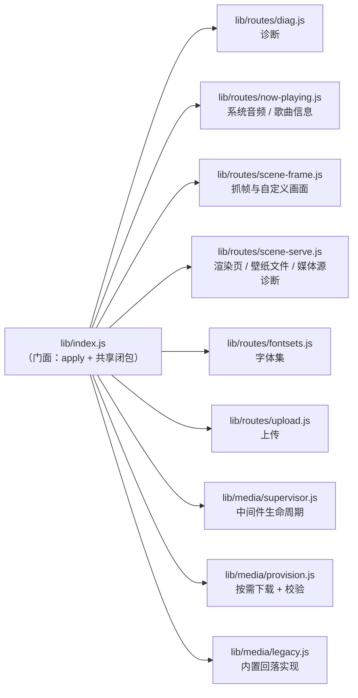
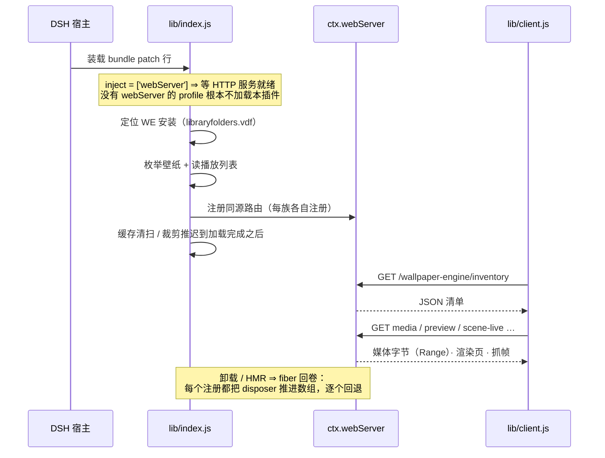
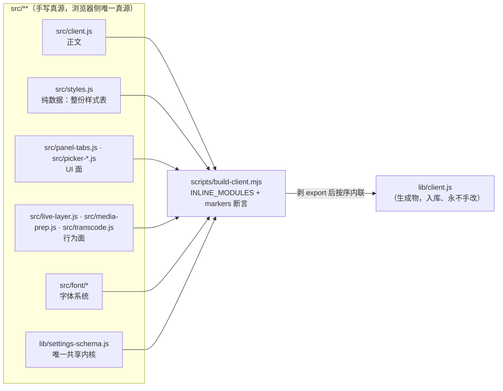
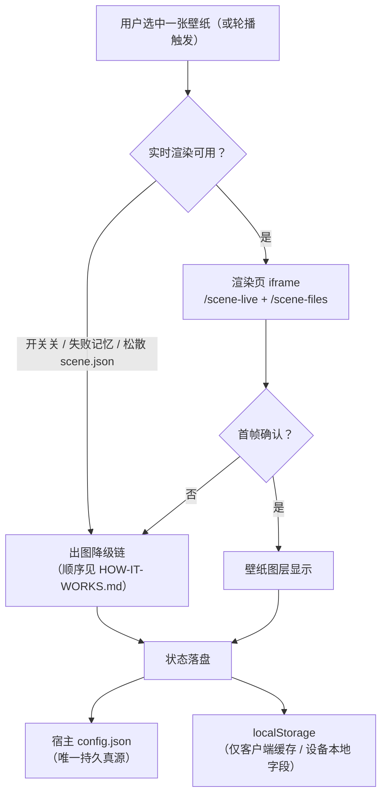

# 代码结构与边界（Code structure）

> **本文回答三件事**：**代码放哪**（新文件落点）、**结构长什么样**（谁调用谁、数据往哪流）、**边界在哪**（什么算越界）。
> **为什么这么选**写在 [`adr/`](./adr/)；**机制与不变量**写在对应文件的头注释里（本仓纪律：能写在代码旁的规则不单写文档）；**怎么加一个东西**见 [`DEV-GUIDE.md`](./DEV-GUIDE.md)。
>
> 本文由两份文档合并而成（原 `MODULE-LAYOUT.md` ⊕ `ARCHITECTURE.md`）：它们本就是同一条轴上的内容 ——
> 前者是**规范**（判据、准入门槛），后者是**总览**（结构、生命周期、真源）。合并它们是为了让"代码结构"
> 只有一处可读，代价是本文比单看任一份长。
>
> **改动纪律**：改本文的**规则**时，若该规则在 §6 有配套守卫，必须**同一次提交**里一并改掉（反之亦然）；
> **没有配套守卫的规则靠约定成立**，不许为了凑"有守卫"而新加一条读散文的判据
> （[`adr/0006`](./adr/0006-comment-discipline-as-written-convention.md)）。
> **不写会漂的数值**（条数 / 行数 / 门槛 / 体积）：一律指向真源或给复算命令。

## 读者路径

| 你想知道 | 读哪里 |
|---|---|
| 用户可见行为、出图降级链、路由表 | [`HOW-IT-WORKS.md`](./HOW-IT-WORKS.md) |
| **代码放哪 / 结构 / 边界** | **本文** |
| 某个设计为什么是这样 | [`adr/`](./adr/) |
| 怎么加一个路由 / 设置项 / 浏览器端模块 / 守卫 | [`DEV-GUIDE.md`](./DEV-GUIDE.md) |
| 跑测试、写测试、两档判据 | [`DEV-GUIDE.md`](./DEV-GUIDE.md) §跑与写 |
| 权限与升级 | [`UPGRADING.md`](./UPGRADING.md) · [`TROUBLESHOOTING.md`](./TROUBLESHOOTING.md) |

---

## 1. 一条轴，不是两条

分工不是"`lib` = 服务端 / `src` = 客户端"，而是两个**正交**属性：

| 属性 | 判据 | 它决定什么 |
|---|---|---|
| **跑在哪个进程** | 要在浏览器里跑吗？ | 放 `src/` 还是 `lib/` |
| **是否随包发布** | 在 `package.json` 的 `files` 里吗？ | 能不能留死码 / 能不能放只给开发用的东西 |

组合出的四格，就是本仓的全部落点：

| | **随包发布** | **不发布（开发面）** |
|---|---|---|
| **浏览器进程** | `lib/client.js` —— **生成物，全仓唯一一个** | `src/**` —— 浏览器侧的**唯一真源** |
| **宿主进程**（Node / Electron main） | `lib/index.js` ＋ 它 import 的 `lib/**` 模块 ＋ `lib/vendor/`、`lib/webwallgl/`（第三方副本） ＋ `lib/types/` | **`test/`（守门：`verify-*` + `*-smoke` + `e2e-*`）· `test/tools/`（诊断/分析/生成工具）** · `scripts/`（只有 `build-client` / `prepare`，构建与发布期用）· `docs/` ＋ 本机未跟踪的研究 / 取证目录（由忽略规则覆盖，**不入库、也不被入库文档引用**） |

### 1.1 一份代码，两个半边（两种运行形态）

本插件是**一个 npm 包**，但同时是两种东西 —— 两条加载路径**互不知道对方存在**：

| 身份 | 入口 | 谁加载它 | 跑在哪 |
|---|---|---|---|
| **Cordis 宿主插件** | `lib/index.js` 的 `inject` / `apply(ctx)` | DSH 宿主按 bundle patch 行装载 | Node（Electron 主进程侧） |
| **DSH 客户端插件** | `lib/client.js`（`exports["./client"]` + `package.json` 的 `dsh.client` 清单） | DSH **客户端加载器**按包元数据取（宿主不提供任何路由发它） | 浏览器 / 渲染进程 |

各自能写什么、改完怎么生效：

| | **宿主半** | **浏览器半** |
|---|---|---|
| 入口 | `lib/index.js`（`package.json` 的 `main`；`apply(ctx)`） | `lib/client.js`（由客户端加载器 `window.__ModuleLoader__.load({ id, factory })` 消费） |
| 源码在哪 | **就是 `lib/*.js` 本身**（手写、直接发布） | **`src/**`**：`src/client.js` 是正文，其余是构建期内联的模块 |
| 可用什么 | `node:*`、`worker_threads`、`child_process`、`fs` | `document`、`fetch`、DSH 客户端 ctx 服务；**无 `node:`、无 `import`** |
| 改完怎么生效 | **必须重启 DSH**（`lib/*.js` 启动时加载，不热更） | `npm run build` 重新生成 `lib/client.js` |

> 两条路径的**唯一接口**是 HTTP 路由表。因此路由表是**生成物**
> （`docs/ROUTE-INDEX.md`，由 `test/tools/host-route-index.mjs` 重算并逐字节核对）—— 手写必烂，本仓有过教训。

---

## 2. 宿主半边：门面 + 路由族

`lib/index.js` 是**门面**：它做注册与协议聚合，**不装新逻辑**。随着功能增长，成族的职责被抽成模块：

**族的形态有明文规定**（§4 第 1 条）：路由模块从 `apply(ctx)` 拿一个**显式 context 对象**
（字段就是它用到但不属于它的东西），而不是继承 `lib/index.js` 的 import。这条边界由守卫
`verify-module-layout` 的『路由模块不得"继承" lib/index.js 的 import』一节钉住。

**为什么门面不拆干净**：一部分共享可变状态（媒体源地址、载荷账本、缓存索引）必须与 `/inventory`
同作用域。因此门面仍持有一组闭包状态，跨模块只能以**访问器**形式出去 —— 传值就是陈旧快照。

### 2.1 启动与生命周期

- **`webServer` 是硬依赖**：声明在 `inject` 上，由 Loader 等待 —— 无 HTTP 服务的 profile
  **不加载**本插件，而不是加载后崩溃。
- **一切注册都经 fiber**：路由、媒体源、定时器、子进程都在卸载时回退。这条不是可选的 ——
  否则卸载 / HMR 后会留下挂着的处理器。
- **`ctx.webServer` 仍防御性读取**：路由表建不起来时要有明确失败，而不是 undefined 崩。

---

## 3. 浏览器半边：构建期内联，不是模块系统

浏览器半边的真源是 `src/**`，但**运行时没有本地模块解析器**（加载器的 `require` 只服务外部包）。
因此拆出去的模块由 `scripts/build-client.mjs` 在**构建期**按 `INLINE_MODULES` 清单
剥掉 `export` 后注入 `lib/client.js` 的**同一个工厂作用域**。

详细取舍见 [`adr/0003`](./adr/0003-build-time-module-inlining.md)。

---

## 4. 新文件放哪（决策程序）

按顺序问五句，第一句命中就停：

1. **要在浏览器里跑吗？**
   → `src/**`，**并且必须登记进 `scripts/build-client.mjs` 的 `INLINE_MODULES`**（含 `markers` 锚点）。
   ⚠️ 忘了登记**不会报错**，只是这个文件永远不进产物（本仓踩过一次）。
   **`src/` 默认平铺**：根目录就是默认落点。只有当一个子系统**同时**满足两条时，才为它建子目录：
   - ① **成员数达到准入门槛**（`.js` 计数，含嵌套）—— 门槛的**唯一真源**是守卫里的
     `SRC_DIR_MIN_MEMBERS`（`test/verify-module-layout.mjs`），本文不抄那个数字；
   - ② **有自己的一份权威文档**，且那份文档的**一级标题**点名这个目录 —— 唯一样本是
     `src/font/`（[`FONT-SYSTEM.md`](./FONT-SYSTEM.md) 的一级标题即 `# src/font/ —— 字体系统`）。
   **为什么门槛这么高**：`src/` 模块之间**没有 `import`**（§5 第 4 条），构建期被拍平进同一个工厂作用域
   ⇒ 目录在这一侧**不承载任何机器含义**：没有解析器、也没有守卫能验证"层次"。它唯一的作用是
   "让人一眼看出这几块是一伙的"，而只有一两个文件的目录做不到这件事，只多一层路径与一次搬动。
   反过来 `lib/` 的目录是**承重**的（Node 真解析相对说明符、`files` 逐文件登记）⇒ 两侧准入条件
   不同，别互抄。判定：`test/verify-module-layout.mjs` ⑥『`src/` 子目录准入』（成员数 + 一级标题
   点名，各带负对照）。
2. **两侧都要用吗？**（同一份数据/规则同时被宿主与客户端消费）
   → 放 `lib/`（宿主 ES `import`）**并**登记进 `INLINE_MODULES`（客户端构建期内联）。
   这就是 `lib/settings-schema.js` 的形态（设置键单一真源），因此它同时受 §5 全部约束（浏览器安全）。
   **这是唯一被允许的共享形态**，第二个共享内核要显式登记（§6 的共享内核白名单）。
3. **是宿主自己的实现吗？**
   → `lib/<语义名>.js` **并加进 `files`**。按职责分子目录（现状：`lib/media/`、`lib/routes/`）。
   门面 `lib/index.js` 只做注册与协议聚合，**不装新逻辑**。
   → **随包的数据文件**（不是代码，但要跟包走）也放 `lib/<语义名>/`，**同样加进 `files`**：
   现状 `lib/fontsets/`（随包预设，只读；用户的编辑按写时复制落 `pluginDataDir()`）。
   `verify-package-files` P1 要求 `files` 覆盖 `lib/` 下**每一个**文件 —— 漏一条这里就红。
4. **是第三方副本 / 类型声明吗？**
   → vendored 放 `lib/vendor/`（内联副本）或 `lib/webwallgl/`（按文本注入的 shim），**不许改**，
   同步走 `test/tools/sync-webwallgl.mjs`；
   → 类型放 `lib/types/*.d.ts`，**必须与代码一致**。
5. **是开发面的东西吗？**（不进发布包）
   → **守门与冒烟 → `test/`**（`verify-*.mjs` 结构守卫、`*-smoke.mjs` 节点级冒烟、`e2e-*.mjs` 真浏览器端到端）；
   → **诊断 / 分析 / 生成工具 → `test/tools/`**（无 CI 消费者的手动工具）；
   → **构建与发布期脚本 → `scripts/`**（只放 `build-client.mjs` / `prepare.mjs` 这类用户与发布流程真的会跑的）。
   ⚠️ `test/tools/` 比 `test/` **深一层** ⇒ 用 `import.meta.url` 推仓库根时要退**两层**
   （`verify-module-layout` 的『相对说明符必须解析到真实文件』有断言钉住）。

**一句话版**：*浏览器手写 → `src/` 且登记内联；两侧共用 → `lib/` 且登记内联；只有宿主 → `lib/` 且登记 `files`；第三方 → vendored 子目录；守门 → `test/`；工具 → `test/tools/`；用户脚本 → `scripts/`。*

**反例（不要这么做）**
- 把"顺手拆出来的工具函数"放 `lib/`，然后又内联进浏览器 —— 边界就从这里开始烂。
- 在 `src/` 建一个文件却不登记 —— 它静默不生效（本仓有过一例）。
- 为了少改一个 import，把宿主模块搬进 `src/` 或反向搬 —— 两侧的**依赖方向是单向**的（§6）。
- 手改 `lib/client.js` 让产物"看起来对"。
- 把一次性诊断脚本丢回 `scripts/` —— 那里只放用户与发布流程真的会跑的脚本（`test/tools/` 才是手动工具的家）。

### 4.1 扩展点速查（加东西时落在哪）

| 要加什么 | 落在哪 | 还必须在哪登记 |
|---|---|---|
| 一条宿主路由 | `lib/routes/<族>.js`（成族才单独成文件，否则就近） | 路由索引由生成器自动重算 |
| 一个设置项 | `lib/settings-schema.js` 的 `DEFAULTS` + `KINDS` | 面板读取即可，**不要另写一张 UI 表** |
| 浏览器端一块 UI / 行为 | `src/<语义名>.js` | `INLINE_MODULES`（**漏登记静默失效**） |
| 字体相关 | `src/font/`（子目录有准入门槛） | 见 [`FONT-SYSTEM.md`](./FONT-SYSTEM.md) |
| 随包的数据文件 | `lib/<语义名>/` | `package.json` 的 `files`（P1 会判） |
| 一条守卫 | `test/`（守门）或 `test/tools/`（手动工具） | 视档位挂进 `verify` / `verify:docs` |

逐步配方（含"改错了会怎样"）见 [`DEV-GUIDE.md`](./DEV-GUIDE.md)。

---

## 5. 硬约束（都由构建期/打包期断言兜住，不是建议）

1. **内联模块必须浏览器安全**：不得出现 `import` / `require(` / `export default` / `process.*` / `__dirname` / `__filename`（`build-client.mjs` 逐条断言，且**先剥注释再判**）。
2. **内联模块不得有顶层可执行语句去读宿主状态**：它们被注入在 bundle 顶部（早于 `src/client.js` 正文），顶层读正文里的 `const` 会撞 TDZ。
3. **名字必须唯一**：内联后与 `src/client.js` 同作用域 ⇒ 重复声明的名字会被构建**机器提取**后断言，冲突即构建失败。
4. **`src/` 模块之间不得 `import`**：它们靠"同一作用域"协作，靠模块头写下的**契约**（需要的外界、对外提供什么）而不是显式依赖。
5. **导出形态**：`src/` 模块用 `export { … }` 列出对外名字；构建剥掉 `export` 关键字与 `export {}` 块。**导出清单同时是守卫的接口**（守卫直接 `import` 模块做行为断言）。
6. **产物入库**：`lib/client.js` 是生成物但**提交**；CI 断言「重建后 `git diff --exit-code -- lib/client.js` 干净」。**永不手改 `lib/client.js`。**
7. **打包面**：`files` 覆盖 `lib/` 全部运行期文件（P1）；具名入口既存在又被发布（P3）；每个运行时模块的**相对导入目标都在磁盘上**（P7）；`dependencies` 每条都真的被 `lib/` import（P4）；build/verify/smoke 链**零裸依赖**（P5）；发布面文件**不得带 UTF-8 BOM**（P8）。
8. **发布面必须"装上就能跑、且不多带东西"**（npm 方向的四条，见 `verify-package-publish`）：
   ① 活的代码所需文件（从 `lib/index.js` 出发的**可达闭包**）必须全在 `files` 里，且闭包里的每个相对
      导入目标都**真实存在于磁盘** —— 指向不存在文件的 import 在仓库里是死路径，装到用户机器上才炸成
      `ERR_MODULE_NOT_FOUND`；
   ② 发布集里不得出现 `src/` `scripts/` `test/` `docs/` 等开发目录；恰有一条白名单 `scripts/prepare.mjs`
      —— `prepare` 在 git 直装、或把包装成根项目执行时真的会跑，它不随包 = 一跑就 `MODULE_NOT_FOUND`；
   ③ 发布文本里不得带**同步机器**的用户目录路径（占位符不算）—— 那是不可复现的元数据；
   ④ `dependencies` 每一条都必须被**可达闭包**加载（死码 import 不算 ⇒ 否则是白下载）。

### 5.1 层间边界（什么算越界）

| 边界 | 规则 | 由什么兜住 |
|---|---|---|
| 宿主 ↔ 浏览器 | 只经**同源 HTTP 路由**；浏览器半边不得 `import` 宿主代码 | 无本地模块解析器（结构上不可能） |
| `lib/` → `src/` | **禁止**：`lib/**` 不得 import `src/**`（依赖方向单向） | `verify-module-layout` ②（零容忍） |
| 发布面 | 留在 `lib/` 的一切都会被发布 ⇒ 死码不许留 | `verify-package-files` · `verify-reachability` |
| 门面 | `lib/index.js` 只做注册与协议聚合，不装新逻辑 | `verify-module-layout`『路由模块不得继承门面 import』 |
| 注释与文档 | 机制写文件头、决策写 ADR、数值指向真源 | **约定**（无守卫，见 [`adr/0006`](./adr/0006-comment-discipline-as-written-convention.md)） |

---

## 6. 守卫（在册的规则由机器判定；不在册的靠约定）

> **只有本表在册的规则才有机器判定。** 不在表里的规则**不是"没有规则"**，而是靠约定成立 ——
> 见前言与 [`adr/0006`](./adr/0006-comment-discipline-as-written-convention.md)：
> **读代码的守卫照留，读文档散文的守卫不加**。
> 两档判据与逐条约定见 [`DEV-GUIDE.md`](./DEV-GUIDE.md) §跑与写。

| 规则 | 现状 | 缺口 |
|---|---|---|
| 内联模块浏览器安全 / `markers` 在位 / 名字不与正文冲突 | ✅ `scripts/build-client.mjs`（构建期硬失败） | — |
| `files` 覆盖 `lib/`；具名入口在位；相对导入目标都在磁盘上；依赖无死声明；工具链零裸依赖；**发布面无 BOM** | ✅ `test/verify-package-files.mjs` P1–P8（各带负对照） | — |
| **发布面自洽（npm 方向）**：可达闭包 ⊆ `files` 且闭包目标在磁盘上在位；发布集无开发目录（白名单只放行 `scripts/prepare.mjs`）；发布文本无**同步机器**的用户目录路径；`dependencies` 每条都被**活的代码**加载；入口/导出目标都在包里；发布出去的 `lib/client.js` 是加载器形态且可解析；安装期脚本不得引用未随包发布的文件 | ✅ `test/verify-package-publish.mjs`（七组，各带负对照） | — |
| `lib/client.js` 与 `src/` 同步 | ✅ CI（重建后 `git diff --exit-code`） | — |
| **`src/` 无孤儿**：除 `src/client.js` 外每个文件都必须在 `INLINE_MODULES` 里 | ✅ `test/verify-module-layout.mjs` ①（全量扫描 + 负对照） | — |
| **依赖方向单向**：`lib/**` 不得 import `src/**` | ✅ 同守卫 ②（零容忍，不需要棘轮） | — |
| **共享内核白名单**：允许被内联进浏览器的 `lib/**` 文件只许来自一张显式清单（现状见守卫里的 `SHARED_KERNEL_WHITELIST`） | ✅ 同守卫 ③（再加一条必须改清单 ⇒ 共享是**决策**而不是顺手） | — |
| **`src/` 子目录准入**：成员数达门槛，且被一份常青文档的一级标题点名（§4 第 1 条的两条门槛） | ✅ 同守卫 ⑥『`src/` 子目录准入』（两条判据各带负对照 + 正对照） | — |
| **相对说明符必须解析到真实文件**：搬动代码后相对路径按新位置重解析（动态 `import()` 的失败是运行期、且常被吞成业务错误 ⇒ 必须静态判定） | ✅ 同守卫 ④『相对说明符必须解析到真实文件』（Node 式解析 + 负对照） | — |
| **类型面与代码同源**：`lib/types/*.d.ts` 必须与实现一致 | ✅ `test/verify-types.mjs`（从实现派生键集断言类型覆盖） | — |

**已从本表撤除**（各自的原因写在对应 ADR 里）：

| 曾被守的规则 | 撤除原因 |
|---|---|
| **本文散文里的数字必须现算**（内联模块计数 == 构建清单条数） | 守的是**措辞**：句子一改写，判据就从"复算数字"退化成"守住那两句话"，开始拦编辑而不是拦腐化。数值改由**符号引用**承担。见 [`adr/0006`](./adr/0006-comment-discipline-as-written-convention.md) |

**本文怎样才算"规范"**：§5 的硬约束与 §6 在册的守卫同时成立即可 —— 两者现在都成立。
升为规范的**过程记录**（当时的四条偏离如何逐条收敛）属于历史，已归档在
[`archive/REFACTOR-ASSESSMENT.md`](./archive/REFACTOR-ASSESSMENT.md) 与 `wip/OPEN-ITEMS.md`，本文不重复。

---

## 7. 状态住哪（唯一真源清单）

| 状态 | 真源 | 谁读 | 结构 |
|---|---|---|---|
| **设置的全部键**（默认值 / 范围 / 枚举） | `lib/settings-schema.js` | 宿主 **和** 客户端 | 构建期内联给浏览器（唯一共享内核） |
| **持久化的值** | 宿主 `config.json` | 宿主写、客户端经 inventory / 保存接口 | 客户端 localStorage 只是缓存 |
| **路由表** | `docs/ROUTE-INDEX.md`（生成物） | 人 + 守卫 | 由 `test/tools/host-route-index.mjs` 复算 |
| **构建期内联清单** | `scripts/build-client.mjs` 的 `INLINE_MODULES` | 构建 + 守卫 | 带 `markers` 锚点 |
| **发布面** | `package.json` 的 `files` | 守卫 P1–P8 | 留在 `lib/` 的一切都会被打进包 |
| **退役线 / 死码基线** | `test/verify-retired-lines.mjs` · `test/verify-reachability.mjs` | 守卫 | 只许缩小 |

> **文档一律不抄这些值**。想知道当前值：设置看 `lib/settings-schema.js`，路由看生成物，
> 条数看 `package.json` 的 scripts —— 抄一份就是多一个无人复算的副本。

---

## 8. 一次壁纸的生命周期（数据流）

> **降级链的成员与顺序只在 [`HOW-IT-WORKS.md`](./HOW-IT-WORKS.md) 定义一处** —— 本文只把它当
> 一个结构节点画出来，**不复制它的步骤**（复制一份就会在下一次调整降级顺序时漏改一处）。

**关键结构性质**：

- **降级是链式的，不是二元的**：任何一级失败都有下一级接手，最后一级允许"诚实留空"。
- **失败记忆分两层**：**共享设置**（所有窗口共用，会被落盘）与**会话内软失败**（不落盘）。
  传输类失败只进后者 —— 一次被饿死的传输不该变成每个窗口的永久降级。
- **隐藏 / 未播放的实例根本不拉载荷**：建层时延迟赋 `src`、切后台摘成 `about:blank`，
  否则它会和看得见的那个抢带宽与解码器。
