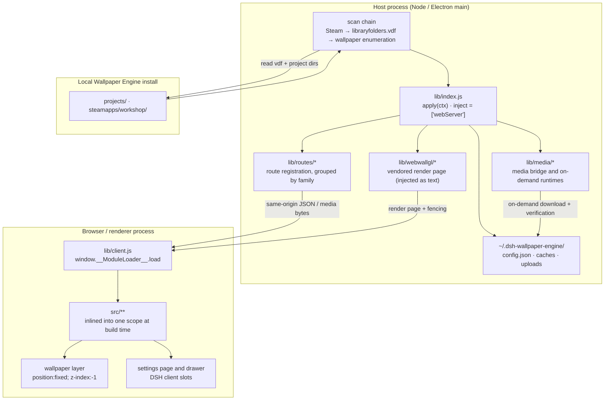
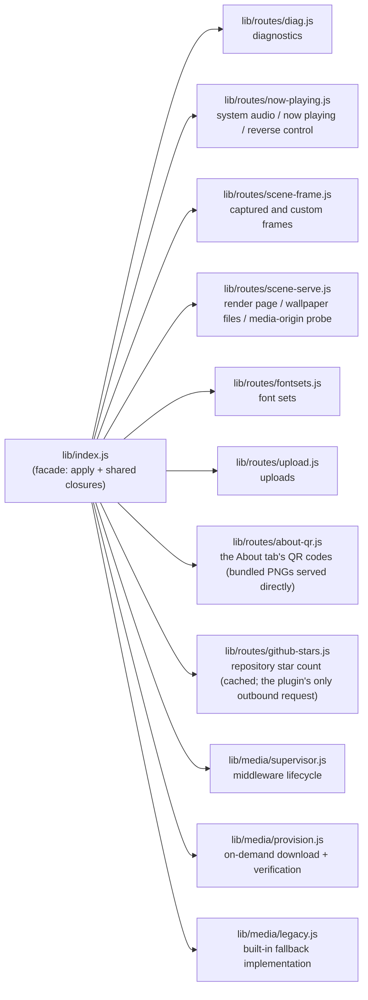
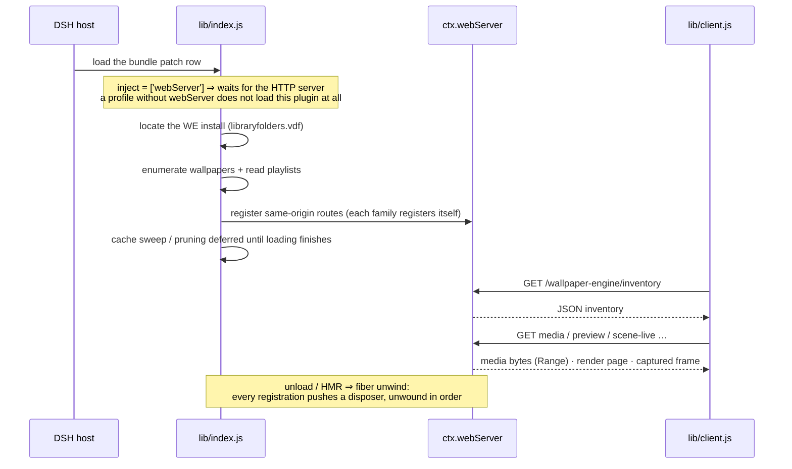
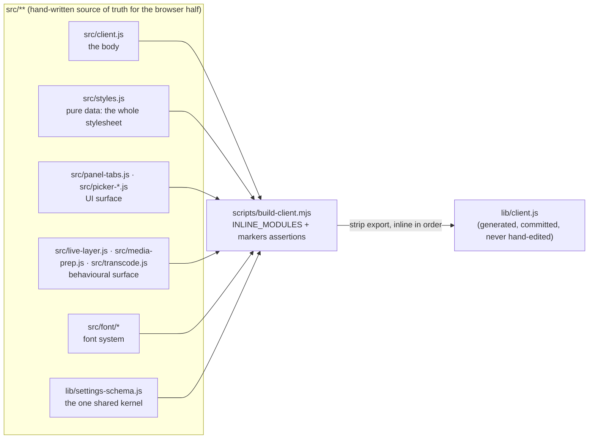
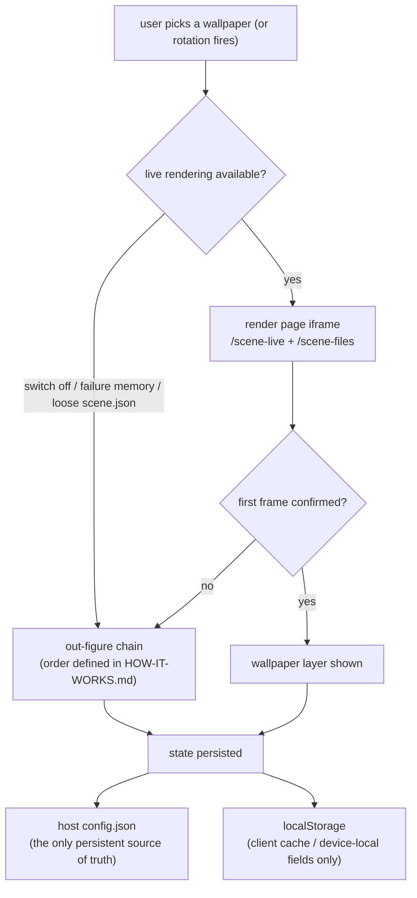

# Code structure

> **中文**: [`../CODE-STRUCTURE.md`](../CODE-STRUCTURE.md)（与本文同源：改一处请同步另一处）

> **This document answers three things**: **where code goes** (where a new file lands), **what the
> structure looks like** (who calls whom, where data flows), and **where the boundaries are** (what
> counts as crossing one).
> **Why it was designed this way** is in [`adr/`](../adr/); **mechanisms and invariants** live in the
> header comments of the files they belong to (this repo's discipline: a rule that can sit next to the
> code is not written up as a document). **How to add something** is in
> [`DEV-GUIDE.md`](../DEV-GUIDE.md).
>
> This document is the merge of two earlier ones (`MODULE-LAYOUT.md` ⊕ `ARCHITECTURE.md`): they were
> always the same axis — one was the **specification** (criteria, admission thresholds), the other the
> **overview** (structure, lifecycle, sources of truth). Merging them means "code structure" has exactly
> one place to read; the cost is that this file is longer than either was alone.
>
> **Editing discipline**: when a **rule** in this document changes and that rule is registered in §6,
> the matching guard must change **in the same commit** (and vice versa); rules **without** a guard hold
> by convention, and you may not add a prose-reading assertion just so a rule can "count"
> ([`adr/0006`](../adr/0006-comment-discipline-as-written-convention.md)).
> **No drifting numbers** (counts, line counts, thresholds, sizes): point at the source of truth or give
> the recompute command.

## Where to read

| What you want to know | Read |
|---|---|
| User-visible behaviour, the out-figure chain, the route table | [`HOW-IT-WORKS.md`](./HOW-IT-WORKS.md) |
| **Where code goes / structure / boundaries** | **this document** |
| Why a design is the way it is | [`adr/`](../adr/) |
| How to add a route / a setting / a browser-side module / a guard | [`DEV-GUIDE.md`](../DEV-GUIDE.md) |
| Running tests, writing tests, the two tiers | [`DEV-GUIDE.md`](../DEV-GUIDE.md) §4 |
| Permissions and upgrading | [`UPGRADING.md`](./UPGRADING.md) · [`TROUBLESHOOTING.md`](./TROUBLESHOOTING.md) |

---

## 1. One axis, not two

The split is **not** "`lib` = server / `src` = client". It is two **orthogonal** properties:

| Property | Question | What it decides |
|---|---|---|
| **Which process it runs in** | Does it have to run in the browser? | `src/` or `lib/` |
| **Whether it ships** | Is it listed in `package.json`'s `files`? | Whether dead code may stay / whether dev-only things may live there |

The four combinations are every landing spot in this repository:

| | **Ships with the package** | **Does not ship (dev surface)** |
|---|---|---|
| **Browser process** | `lib/client.js` — **a generated artifact, the only one in the repo** | `src/**` — the **single source of truth** for the browser half |
| **Host process** (Node / Electron main) | `lib/index.js` + the `lib/**` modules it imports + `lib/vendor/`, `lib/webwallgl/` (third-party copies) + `lib/types/` | **`test/` (guards: `verify-*` + `*-smoke` + `e2e-*`) · `test/tools/` (diagnostics / analysis / generators)** · `scripts/` (only `build-client` / `prepare`, used at build and publish time) · `docs/` + the machine-local research / evidence directories (covered by ignore rules, **not committed and not referenced by committed documents**) |

### 1.1 One codebase, two halves (two runtime forms)

This plugin is **one npm package** that is two things at once — and the two loading paths **do not know
about each other**:

| Identity | Entry | Who loads it | Where it runs |
|---|---|---|---|
| **Cordis host plugin** | `inject` / `apply(ctx)` in `lib/index.js` | the DSH host, from the bundle patch row | Node (Electron main side) |
| **DSH client plugin** | `lib/client.js` (`exports["./client"]` + the `dsh.client` manifest in `package.json`) | the DSH **client loader**, from package metadata (the host serves it over no route at all) | browser / renderer process |

What each side may write, and how an edit takes effect:

| | **Host half** | **Browser half** |
|---|---|---|
| Entry | `lib/index.js` (`package.json`'s `main`; `apply(ctx)`) | `lib/client.js` (consumed by the client loader's `window.__ModuleLoader__.load({ id, factory })`) |
| Where the source is | **`lib/*.js` itself** (hand-written, published directly) | **`src/**`**: `src/client.js` is the body, the rest are build-time-inlined modules |
| What is available | `node:*`, `worker_threads`, `child_process`, `fs` | `document`, `fetch`, DSH client ctx services; **no `node:`, no `import`** |
| How an edit takes effect | **DSH must restart** (`lib/*.js` is loaded at startup, never hot-updated) | `npm run build` regenerates `lib/client.js` |

> The **only interface** between the two paths is the HTTP route table. That is why the route table is a
> **generated artifact** (`docs/ROUTE-INDEX.md`, recomputed and byte-compared by
> `test/tools/host-route-index.mjs`) — hand-writing it always rots, and this repo has the scars.

---

## 2. The host half: a facade plus route families

`lib/index.js` is a **facade**: it registers and aggregates the protocol, and **holds no new logic**. As
the feature set grew, whole families were extracted into modules:

**The shape of a family is specified** (§4 item 1): a route module receives an **explicit context object**
from `apply(ctx)` — fields are the things it uses but does not own — instead of inheriting
`lib/index.js`'s imports. That boundary is pinned by the guard section in `verify-module-layout` named
『路由模块不得"继承" lib/index.js 的 import』.

**Why the facade is not fully emptied**: some shared mutable state (the media-origin address, the payload
ledger, the cache index) must live in the same scope as `/inventory`. So the facade still owns a set of
closures, and cross-module access may only be through **accessors** — passing a value out is a stale
snapshot.

### 2.1 Startup and lifecycle

- **`webServer` is a hard dependency**: declared on `inject` and awaited by the Loader — a profile with no
  HTTP server **does not load** this plugin, rather than loading and then crashing.
- **Every registration goes through the fiber**: routes, the media origin, timers and child processes are
  all reverted on unload. This is not optional — otherwise an unload / HMR leaves live handlers behind.
- **`ctx.webServer` is still read defensively**: when the route table cannot be built there must be a
  clear failure, not an `undefined` crash.

---

## 3. The browser half: build-time inlining, not a module system

The browser half's source of truth is `src/**`, but **there is no local module resolver at runtime** (the
loader's `require` serves external packages only). So extracted modules are stripped of their `export`s
at **build time** by `scripts/build-client.mjs`, following the `INLINE_MODULES` list, and injected into
the **same factory scope** of `lib/client.js`.

The trade-offs are recorded in [`adr/0003`](../adr/0003-build-time-module-inlining.md).

**The most under-estimated consequence of "one scope" is names**: modules are flattened into a single
scope once their `export` is stripped, so

| The name question | What backs it |
|---|---|
| module names ∩ the `client.js` body | the build **machine-extracts** each module's top-level declaration names + its `export {…}` list and compares them against the body — a clash is `exit 1` |
| collisions **between modules** | the build's **artifact syntax check** (`vm.Script`) — flattened, this is `Identifier '…' has already been declared`, and the build fails naming it |
| a missing `markers` anchor | asserted one by one; any miss is a hard failure (so "that block is still there" is not left to the eye) |
| every `src/` module actually gets inlined | `verify-module-layout` ① (zero orphans beyond `client.js`) |
| relative specifiers still resolve after a move | same guard ④ (Node-style resolution — a dynamic `import()` failure is a runtime failure, so it must be decided statically) |
| browser safety (no `import` / `require` / Node API) | asserted one by one at build time, **after stripping comments** |

> ⚠️ The one thing that does **not** fail loudly is **forgetting to register in `INLINE_MODULES`** — the
> file simply never reaches the artifact and the first call site becomes a `ReferenceError` at runtime
> (this repo has been bitten once). It is the most dangerous failure mode of this route.

### 3.1 What "the same scope" actually means (module roles and dependency direction)

**This is the layer of the browser half that is easiest to misjudge**: the modules **do not import** each
other, yet they share **one flat symbol namespace** ⇒ "where does this module get its outside world from"
is not expressed by an import but by **which file header declares it**. (Per-module contracts and
dependency lists live in **each file header**; this document does not copy them.)

| Role | Modules | Who supplies its outside world |
|---|---|---|
| **State source of truth + assembly (the facade)** | `src/client.js` (the body) | holds it itself: the settings store (`selection`), persistence, `apiFetch`, the `weT` wiring, the React root, and the place where `ctx` is assembled |
| **`ctx`-receiving render / behaviour layer** | `live-layer` · `panel-tabs` · `sidebar-right` · `picker-modal` · `picker-props-panel` · `theme-follow` · `fontset-editor` · `font/apply` · `font/color-roles` | **the facade assembles `ctx` at the call site** — this layer never reads `selection` directly |
| **Bedrock (no `ctx`; reads the flat symbols)** | `media-prep` · `picker-model` · `transcode` · `effects` · `quick-panel` · `i18n` · `api-client` · `adapter` · `we-cond` · `persistence` · `fontset-store` | reads symbols from **the same scope**; its own symbols are in turn read by the body |
| **Pure data / constant tables** | `styles.js` (the whole stylesheet) · `i18n-copy.js` (the dictionaries) · `about-assets.js` · `font/typography.js` · `font/components.js` | no outside world |
| **Channels / utilities** | `nav-icon` · `persistence` · `fontset-store` | see each file header |

**The dependency direction is one-way, but each side means something different**:

- body → module (handing it `ctx`, or reading the module's top-level declarations) = **normal**;
- module → body as a **top-level read** is **forbidden**: the injection point is at the **top** of the
  bundle, earlier than the body ⇒ a TDZ (see §5 item 2);
- conversely, "a module exports a symbol for the body to read" is **allowed** (which is why
  `live-layer`'s `LIVE_FIRST_FRAME_MS` is exported).

⇒ **Before changing a constant, first confirm which file it lives in** — changing the wrong place
"looks like it changed but did nothing".

> Why this deserves its own subsection: §1.1's two-halves diagram stops at "`src/**` is inlined into one
> scope", and what "one scope" **actually means** (who may read whom, and where a change counts) was
> written down nowhere — each module header states only **its own** contract, so this cross-module role
> table could only be rebuilt by reading 20-odd headers.

### 3.2 Styles and tokens: three layers, one entry point each

UI styling **lives in no `.css` file** (except the vendored render page under `lib/webwallgl/`, which is
unrelated to the plugin UI). It comes in three layers, and **each has exactly one entry point**:

| Layer | Source / entry | How it takes effect | What to edit |
|---|---|---|---|
| **The whole stylesheet** | the single template constant in `src/styles.js` (pure data) | inlined into the bundle at build time; at runtime `ensurePluginCss()` mounts that one `<style>` into `document.head` with a `data-plugin-css` marker and a **generation** marker, refreshing it from the current bundle on a remount | `src/styles.js` → `npm run build` |
| **Runtime tokens** (`--we-*`) | `src/effects.js`: `applyEffects()` writes the whole family of CSS variables onto **`document.body.style`** (the remaining writers are scattered across `src/live-layer.js` and `src/font/apply.js`, each owning its own few — **to count them right now, recompute**: `git grep -c 'setProperty(' -- src`) | rules in the stylesheet read `var(--we-*)`; a settings change rewrites those properties | `src/effects.js` (**not** `styles.js`) |
| **Font customisation** | `src/font/apply.js` (host default snapshot + component-scoped stylesheet) | a separate channel — see [`FONT-SYSTEM.md`](../FONT-SYSTEM.md) | `src/font/` |

> **Assertions follow the same split**: `verify-readability` **extracts** the clamping function from
> `src/effects.js` **in the artifact** and recomputes the contrast grid (so "just tweak the stylesheet to
> pass" does not work); `verify-host-paint-scope` takes the stylesheet from the artifact to decide
> "full-viewport overlays let window dragging through". ⇒ **Edit whichever layer's source of truth is
> responsible** — this is what "define it once" looks like for styling.

---

## 4. Where a new file goes (the decision procedure)

Ask six questions in order; stop at the first hit:

1. **Does it have to run in the browser?**
   → `src/**`, **and it must be registered in `INLINE_MODULES`** in `scripts/build-client.mjs` (with its
   `markers` anchors). ⚠️ Forgetting to register **does not error** — the file simply never reaches the
   artifact (this repo has been bitten once).
   **`src/` is flat by default**: the root is the default landing spot. A subdirectory is created only
   when a subsystem satisfies **both** conditions:
   - ① **its member count reaches the admission threshold** (`.js` count, nested included) — the
     **single source of truth** for the threshold is `SRC_DIR_MIN_MEMBERS` in the guard
     (`test/verify-module-layout.mjs`); this document does not copy the number;
   - ② **it has an authoritative document of its own**, whose **top-level heading** names the directory —
     the only instance is `src/font/` ([`FONT-SYSTEM.md`](../FONT-SYSTEM.md)'s H1 is `# src/font/ —— 字体系统`).
     ⚠️ **This one is a pure convention, with no guard**: `verify-module-layout` ⑥ used to carry an
     "H1 names it" assertion, removed per
     [`adr/0007`](../adr/0007-machine-checks-target-code-not-prose.md) — it guarded the *wording of a
     heading*, and **an empty-shell document (right heading, empty body) passes it anyway**, so it
     guarded form rather than substance.
   **Why the bar is this high**: `src/` modules do not `import` each other (§5 item 4) — they are
   flattened into one factory scope at build time ⇒ a directory carries **no machine meaning** on this
   side: there is no resolver and no guard that could verify "layering". Its only job is to let a reader
   see at a glance that these pieces belong together, and a directory of one or two files fails at that
   while still costing a path segment and a move.
   On the `lib/` side directories **carry weight** (Node really resolves relative specifiers, and `files`
   registers file by file) ⇒ the admission conditions differ; do not copy one side's rules to the other.
   **① is judged by `verify-module-layout` ⑥ (with a negative control); ② rests on convention.**
2. **Do both sides need it?** (the same data/rules consumed by host and client)
   → put it in `lib/` (host ES `import`) **and** register it in `INLINE_MODULES` (client build-time
   inlining). This is the shape of `lib/settings-schema.js` (the single source of truth for settings
   keys), which is why it is also bound by every constraint in §5 (browser safety).
   **This is the only permitted shared form**; a second shared kernel must be registered explicitly
   (§6's shared-kernel allowlist).
3. **Is it the host's own implementation?**
   → `lib/<semantic-name>.js` **and add it to `files`**. Group by responsibility into subdirectories
   (currently `lib/media/`, `lib/routes/`). The facade `lib/index.js` only registers and aggregates the
   protocol — **it holds no new logic**.
   → **Data files that ship with the package** (not code, but they must travel with it) also live in
   `lib/<semantic-name>/` and **must also be added to `files`**: currently `lib/fontsets/` (shipped
   presets, read-only; user edits land in the plugin data directory via copy-on-write).
   `verify-package-files` P1 requires `files` to cover **every** file under `lib/` — miss one and it goes
   red here.
4. **Is it a third-party copy / type declaration?**
   → vendored code goes in `lib/vendor/` (inlined copy) or `lib/webwallgl/` (a shim injected as text),
   **must not be modified**, and is synced via `test/tools/sync-webwallgl.mjs`;
   → types go in `lib/types/*.d.ts` and **must match the code**.
5. **Is it dev-surface?** (it does not ship)
   → **guards and smoke tests → `test/`** (`verify-*.mjs` structural guards, `*-smoke.mjs` node-level
   smoke, `e2e-*.mjs` real-browser end-to-end);
   → **diagnostics / analysis / generators → `test/tools/`** (manual tools with no CI consumer);
   → **build- and publish-time scripts → `scripts/`** (only things the user or the publish flow actually
   runs, like `build-client.mjs` / `prepare.mjs`).
   ⚠️ `test/tools/` is **one level deeper** than `test/` ⇒ when deriving the repo root from
   `import.meta.url` you must go up **two** levels (pinned by `verify-module-layout`'s
   『相对说明符必须解析到真实文件』).
6. **Is it design source material?** (raw assets, not shipped)
   → `assets/<purpose>/`, in-repo but **not in `files`**; the version the plugin actually serves is a
   **derived artifact** under `lib/<purpose>/`, which **does** go in `files` (P1 of
   `verify-package-files` watches it).
   Two today: `assets/mascot/` and `assets/about/` (QR-code sources → the code-area crop in
   `lib/about/*.png`, served by `lib/routes/about-qr.js`).
   ⚠️ A `README.md` in such a directory is **that directory's own account** (write it there when a
   file header will not do: the derivation recipe, the steps for swapping the asset, and the
   "sources are not shipped" invariant) — the **same kind of thing as a `lib/**` `README.md`**.
   They are **deliberately outside `docs/`'s lifecycle rules** (they are not evergreen documents and
   do not evolve with versions), but they **must be reachable from somewhere** — e.g.
   `assets/about/README.md` is linked from the root `README.md`'s contact section.

**One-liner**: *hand-written browser code → `src/` and register the inline; used by both sides → `lib/`
and register the inline; host only → `lib/` and register in `files`; third-party → a vendored
subdirectory; guards → `test/`; tools → `test/tools/`; user scripts → `scripts/`; design sources →
`assets/` (with the derived artifact under `lib/`).*

**Anti-patterns (don't do these)**
- Putting a "utility function I extracted along the way" in `lib/` and then inlining it into the browser
  — that is where the boundary starts rotting.
- Creating a file under `src/` without registering it — it silently does nothing (this happened once here).
- Moving a host module into `src/` (or back) to avoid touching an import — the dependency direction
  between the two sides is **one-way** (§6).
- Hand-editing `lib/client.js` so the artifact "looks right".
- Throwing a one-off diagnostic script back into `scripts/` — that directory is only for scripts the user
  or the publish flow actually runs (`test/tools/` is where manual tools live).

### 4.1 Extension points at a glance (where an addition lands)

| What you are adding | Where it lands | What else must be registered |
|---|---|---|
| A host route | `lib/routes/<family>.js` (its own file only once the family is big enough, otherwise nearby) | the route index is recomputed by the generator |
| A setting | `DEFAULTS` + `KINDS` in `lib/settings-schema.js` | the panel reads it — **do not write a second UI table**. ⚠️ If it involves **font roles / the type-size floor and ceiling**, the browser-side copy (`src/font/color-roles.js` / `typography.js`) **must change too** (see §7 row 1) |
| State both halves need | `lib/<semantic-name>.js` | `INLINE_MODULES` (build-time inlining; this is the **only** permitted shared form) |
| A piece of browser UI / behaviour | `src/<semantic-name>.js` | `INLINE_MODULES` (**forgetting is silently ineffective**) |
| Anything font-related | `src/font/` (the subdirectory has admission conditions) | see [`FONT-SYSTEM.md`](../FONT-SYSTEM.md) |
| A data file that ships | `lib/<semantic-name>/` | `package.json`'s `files` (P1 checks it) |
| Design source assets (raw material, not shipped) | `assets/<purpose>/` | the version actually served is a **derived artifact** ⇒ `lib/<purpose>/`, and it goes in `files`; the source-asset recipe lives in `assets/<purpose>/README.md` |
| A guard | `test/` (guards) or `test/tools/` (manual tools) | the right chain: `verify` vs `verify:docs` |

Step-by-step recipes (including "what happens if you get it wrong") are in [`DEV-GUIDE.md`](../DEV-GUIDE.md).

---

## 5. Hard constraints (all backed by build- or package-time assertions, not suggestions)

1. **Inlined modules must be browser-safe**: no `import` / `require(` / `export default` / `process.*` /
   `__dirname` / `__filename` (`build-client.mjs` asserts each one, **after stripping comments**).
2. **Inlined modules must not have top-level statements that read host state**: they are injected at the
   **top** of the bundle (before the `src/client.js` body), so a top-level read of a `const` declared in
   the body hits a TDZ.
3. **Names must be unique**: they end up in the same scope as `src/client.js` ⇒ duplicates are
   machine-extracted and asserted at build time; a conflict fails the build.
4. **`src/` modules must not `import` each other**: they cooperate through "the same scope", using the
   **contract** written in their file headers (what they need from outside, what they expose) rather than
   explicit dependencies.
5. **Export shape**: `src/` modules list their public names with `export { … }`; the build strips the
   `export` keyword and `export {}` blocks. **That export list is also the guards' interface** (guards
   `import` modules directly to assert behaviour).
6. **The artifact is committed**: `lib/client.js` is generated but **submitted**; CI asserts
   「after a rebuild, `git diff --exit-code -- lib/client.js` is clean」. **Never hand-edit it.**
7. **Packaging surface**: `files` covers every runtime file under `lib/` (P1); named entries both exist
   and ship (P3); every runtime module's **relative import targets exist on disk** (P7); every
   `dependencies` entry is actually imported by `lib/` (P4); build/verify/smoke chains have **zero bare
   dependencies** (P5); published files **carry no UTF-8 BOM** (P8).
8. **The publish surface must "work once installed, and carry nothing extra"** (the four npm-direction
   rules, see `verify-package-publish`):
   ① every file the live code needs (the **reachable closure** from `lib/index.js`) must be in `files`,
      and every relative import target inside that closure must **exist on disk** — an import pointing at
      a missing file is a dead path in the repo and only blows up on a user's machine as
      `ERR_MODULE_NOT_FOUND`;
   ② the published set must contain no dev directories (`src/` `scripts/` `test/` `docs/`); there is
      exactly one allowlisted exception, `scripts/prepare.mjs` — `prepare` really does run on a git
      install or when the package is executed as a root project, so not shipping it means
      `MODULE_NOT_FOUND` on first run;
   ③ published text must not carry a **sibling machine's** home directory path (placeholders don't count)
      — that is irreproducible metadata;
   ④ every `dependencies` entry must be loaded by the **reachable closure** (an import from dead code
      does not count ⇒ otherwise it is a download for nothing).

### 5.1 Boundaries between layers (what counts as crossing one)

| Boundary | Rule | Backed by |
|---|---|---|
| Host ↔ browser | only through **same-origin HTTP routes**; the browser half must not `import` host code | no local module resolver (structurally impossible) |
| `lib/` → `src/` | **forbidden**: `lib/**` must not import `src/**` (the dependency direction is one-way) | `verify-module-layout` section ② (zero tolerance) |
| Publish surface | everything left in `lib/` ships ⇒ dead code may not stay | `verify-package-files` · `verify-reachability` |
| The facade | `lib/index.js` only registers and aggregates; it holds no new logic | `verify-module-layout` 『路由模块不得继承门面 import』 |
| Comments and docs | mechanisms in file headers, decisions in ADRs, numbers pointing at sources of truth | **convention** (no guard, see [`adr/0006`](../adr/0006-comment-discipline-as-written-convention.md)) |

---

## 6. Guards (the batch named after this document's structural rules; the full list lives in `package.json`)

> **This table registers only the machine judgements directly tied to this document's structural rules**;
> it is not a complete roster. **The source of truth for the full list is the `verify` / `verify:docs` /
> `smoke` scripts in `package.json`** (read them; copying a count in here just adds a copy nobody
> recomputes) — the two tiers, the per-item conventions and the run matrix are in
> [`DEV-GUIDE.md`](../DEV-GUIDE.md) §4.
>
> So **absent from this table ≠ no machine judgement**. The chain also carries a batch of structural
> assertions that read **code** and do not overlap §1–§5's boundaries (generated route index, i18n
> two-way reconciliation, cross-half contracts, `/about-qr` assets being inside the package, dead
> declarations, the reachability ratchet, retired lines, module-layout ⑤/⑦/⑧, artifact sync) — they are
> deliberately not copied in row by row.
> The boundary discipline itself is
> [`adr/0006`](../adr/0006-comment-discipline-as-written-convention.md) /
> [`adr/0007`](../adr/0007-machine-checks-target-code-not-prose.md):
> **guards that read code stay; guards that read prose are not added.**

| Rule | Status (with tier: the hard tier blocks a PR / **the soft tier only speaks**) | Gap |
|---|---|---|
| Inlined modules are browser-safe / `markers` present / names don't collide with the body | ✅ `scripts/build-client.mjs` (hard build failure) | — |
| `files` covers `lib/`; named entries exist; relative import targets are on disk; no dead dependency declarations; zero bare deps in the toolchain; **no BOM on the publish surface**; the inlined artifact parses under `node --check` | ✅ `test/verify-package-files.mjs` P1–P8 (**six of them carry negative controls**; P1/P3 reuse P2's predicate rather than adding one) | — |
| **Publish surface is self-consistent (npm direction)**: reachable closure ⊆ `files` and closure targets exist on disk; no dev directories in the published set (only `scripts/prepare.mjs` is allowlisted); published text carries no **sibling machine** home path; every `dependencies` entry is loaded by **live code**; entry/export targets are inside the package; the published `lib/client.js` is loader-shaped and parses; install-time scripts reference no file that isn't shipped | ✅ `test/verify-package-publish.mjs` (**seven groups, six with negative controls**; the "entry and export targets" group is positive-only) | — |
| `lib/client.js` is in sync with `src/` | ✅ `test/verify-client-sync.mjs` — the **first entry in the `verify` chain**: it really rebuilds and compares byte-for-byte after folding line endings (**it does not use git**); CI adds `git diff --exit-code` as a second leg | — |
| **No `src/` orphans**: apart from `src/client.js`, every file must be in `INLINE_MODULES` | ✅ `test/verify-module-layout.mjs` ① (full scan + negative control) · **soft tier** | — |
| **One-way dependency direction**: `lib/**` must not import `src/**` | ✅ same guard ② (zero tolerance, no ratchet needed) · **soft tier** | — |
| **Shared-kernel allowlist**: the only `lib/**` file allowed to be inlined into the browser comes from an explicit list (see `SHARED_KERNEL_WHITELIST` in the guard) | ✅ same guard ③ (adding one requires editing the list ⇒ sharing is a **decision**, not a convenience) · **soft tier** | — |
| **`src/` subdirectory admission (① member count)**: the `.js` count reaches `SRC_DIR_MIN_MEMBERS` (one of the two bars in §4 item 1; ② "it has an authoritative document of its own" is **convention, with no guard**) | ✅ same guard ⑥ (with a negative control) · **soft tier** | — |
| **Relative specifiers must resolve to real files**: after moving code, relative paths are re-resolved from the new location (a dynamic `import()` failure happens at runtime and is often swallowed as a business error ⇒ it must be decided statically) | ✅ same guard ④『相对说明符必须解析到真实文件』(Node-style resolution + negative control) · **soft tier** | — |
| **The type surface and the code share one source**: `lib/types/*.d.ts` must match the implementation | ✅ `test/verify-types.mjs`: the `.d.ts` **declaration set == a hand-pinned required-field set**, and every field really has a producer in the implementation | — |

**Removed from this table** (each reason is recorded in its ADR):

| Rule that used to be guarded | Why it was removed |
|---|---|
| **Numbers in this document's prose must be recomputed** (inline module count == build list length) | It guarded **wording**: once a sentence is rephrased, the assertion degrades from "recompute the number" to "keep those two sentences", and it starts blocking edits rather than rot. Values are now carried by **symbol references**. See [`adr/0006`](../adr/0006-comment-discipline-as-written-convention.md) |
| **A `src/` subdirectory must be named by some evergreen document's top-level heading** (§4 item 1 bar ②) | It guarded the **wording of a heading**, and **an empty-shell document passes it anyway** ⇒ form rather than substance. Bar ② now rests on convention. See [`adr/0007`](../adr/0007-machine-checks-target-code-not-prose.md) |
| **Wording fragments inside source** (the status line's three branch labels, hint sentences, `ESC 返回`, a four-character status fragment, and the settings entry's `/设置\|Settings/i` anchor) | Questions 1/4: the thing judged is **human wording**. The settings-entry one was worse — its failure signal demanded "keep it as it is", and "as it is" *was* the locale defect ⇒ the assertion stood against the fix. Now it judges the **mechanism**: three branches each wrapped in `weT(...)` (`test/verify-adapter.mjs`); the candidate-set anchor exists plus gating / excluding our own entry / nameless fallback / the re-entrancy lock (`test/verify-scene-live.mjs`). See [`adr/0007`](../adr/0007-machine-checks-target-code-not-prose.md) |
| **Acceptance criteria for a one-off cleanup** (the retired-line check "the typo 「秡」 no longer appears") | Vacuously true once fixed; per §writing discipline 5 ("emptying the baseline *is* zero residue"), it should be retired at close-out. See [`adr/0007`](../adr/0007-machine-checks-target-code-not-prose.md) |

**When this document counts as a "specification"**: when §5's hard constraints and §6's registered guards
both hold — both do now. The **process record** of how it got there (how each of the four deviations was
closed) is history and lives in [`archive/REFACTOR-ASSESSMENT.md`](../archive/REFACTOR-ASSESSMENT.md) and
`wip/OPEN-ITEMS.md`; this document does not repeat it.

---

## 7. Where state lives (the source-of-truth list)

| State | Source of truth | Who reads it | Shape |
|---|---|---|---|
| **Every settings key** (defaults / ranges / enums) | `lib/settings-schema.js` | host **and** client | build-time-inlined into the browser (the one shared kernel). ⚠️ **But the 5 text-colour role ids, the 12 typography role ids and the type-size floor/ceiling each have a verbatim duplicate** in `src/font/color-roles.js` / `src/font/typography.js` — because the host also `import`s the schema while `src/font/**` only ships in the browser bundle (that file's own comment at `:380`: "the two must agree") ⇒ **changing a role means changing both**, reconciled by `verify-theme-layer` / `verify-component-fonts` |
| **Persisted values** | the host's `config.json` | the host writes; the client reads the inventory and writes through the save endpoints **plus three root-field endpoints** (`/we-assets-dir` · `/upload-dir` · `/fontsets`' `activate`) | client `localStorage` = a **cache** of settings **plus device-local fields** (`rope-pos` / `picker-tab` / `qp-view` / `weLive*` — which go into **neither** `config.json` nor the schema allowlist) |
| **UI language + dictionaries** | the **host locale service**'s `getSnapshot().active` (not a plugin setting; defaults to `zh`, overridable with `?we-lang`) | `src/i18n.js` broadcasts to subscribers ⇒ client `weT(...)`; non-React DOM patches go through `weOnLocaleChange` | the dictionaries live in two tables in `src/i18n-copy.js` (client / host); the key sets are reconciled **both ways** by `verify-i18n` (missing translation, orphan key, and unwrapped Chinese literal each have their own assertion). Goes into **neither** `config.json` nor the schema |
| **The active font set** | the `fontSetId` root field of `config.json` ⇒ `lib/fontsets/*.json` (shipped read-only presets) + `pluginDataDir()/fontsets` (user layer, copy-on-write) | host route `/fontsets`; client `src/fontset-store.js` | **a second source of truth parallel to settings** (the `why` text in `build-client.mjs` says so verbatim) — the six font keys are **not** in the settings allowlist; `localStorage`'s `we-fontset-active` is only a cache |
| **The route table** | `docs/ROUTE-INDEX.md` (generated) | humans + guards | recomputed by `test/tools/host-route-index.mjs` |
| **The build-time inline list** | `INLINE_MODULES` in `scripts/build-client.mjs` | the build + guards | carries `markers` anchors |
| **The publish surface** | `package.json`'s `files` | guards P1–P8 | everything left in `lib/` ships |
| **Star-count cache** (the state of the plugin's only outbound request) | `lib/routes/github-stars.js`: in-process TTL + `pluginDataDir()/star-count.json` | the client's `starCount` mirror in `src/client.js` (**with a TTL constant of its own**) | the repository address's source of truth is `package.json`'s `repository`, read **live** by the host (no second literal); a failed fetch does **not** write a timestamp |
| **The About tab's static data** | `src/about-assets.js` (repository URL + the two route paths) | client rendering + `lib/routes/about-qr.js` serving the PNGs | the QR **source images** are in `assets/about/` (not shipped); what ships is the cropped `lib/about/*.png`; the filename allowlist has a **verbatim duplicate** on the server side (swapping a code means swapping the PNG only, no rebuild) |
| **Retired lines / dead-code baseline** | `test/verify-retired-lines.mjs` · `test/verify-reachability.mjs` | guards (**soft tier**: they speak but do not block) | the former = "what is on the retired line **must not come back**"; the latter = the unreachable count **may only shrink** (a ratchet) |
| **The host requirement for upstream** | **`engines.dsh`** in `package.json` | **the plugin market and DSH's own plugin-manager UI** read it straight off the published manifest (the community catalog is not involved), show it on the plugin card and compare it against the running host; humans read the same prose in the three READMEs and [`UPGRADING.md`](../UPGRADING.md) | that machine-readable copy exists in **exactly one place**; the prose echoes it, so **changing one means changing all of them**. Dependencies that are **not** `@deepseek-ai/*` — `dsh-better-sidebar` is one — **cannot** be expressed there and live only in that prose |

> **Documents never copy these values.** To find the current value: settings in
> `lib/settings-schema.js`, routes in the generated index, counts in `package.json`'s scripts — a copy is
> one more thing nobody recomputes.
>
> **This table and §8 use the same wording**: `localStorage` holds both "a cache of settings" and fields
> that belong to **this device only** (row 2 above) — the latter are not an echo of any host state, so
> "just clear the cache and rebuild" does not cover them.
>
> **Derived caches are deliberately not in this table**: GPU / static frames, transcode output
> (`tc_*.mp4`, LRU by size), video previews, live frames, diagnostic directories, the inventory
> (seconds-scale TTL), and the Steam / embedded-MP4 probes (the latter's invariant: a miss means
> **unknown → null, never guess**). Their source of truth is the **wallpaper file itself**, and all of
> them can be deleted and rebuilt.

---

## 8. The lifecycle of one wallpaper (data flow)

> **The members and order of the degradation chain are defined in exactly one place,
> [`HOW-IT-WORKS.md`](./HOW-IT-WORKS.md)** — this document only draws it as a structural node and
> **does not copy its steps** (a copy would be one more place to forget when the order changes).

**Key structural properties**:

- **Degradation is a chain, not a binary**: every tier that fails hands over to the next, and the last
  one is allowed to stay **honestly empty**.
- **Failure memory has two layers**: **shared settings** (used by every window, persisted) and
  **session-local soft failures** (not persisted). Transfer-class failures only enter the latter — one
  starved transfer must not become a permanent downgrade for every window.
- **Hidden / non-playing instances never pull the payload at all**: the layer gets its `src` late, and
  going to the background swaps it for `about:blank`; otherwise it would compete for bandwidth and
  decoders with the instance that *is* visible.
